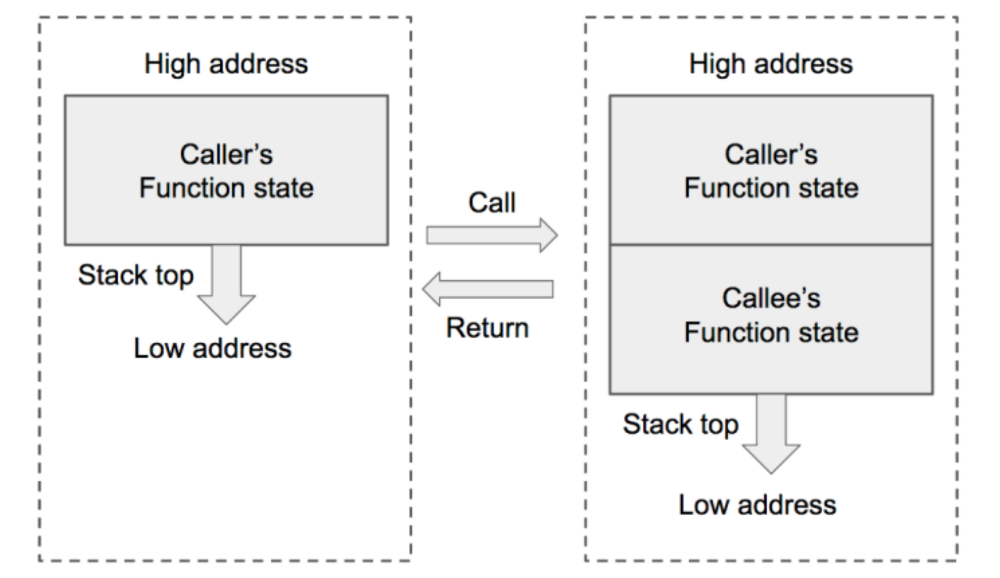
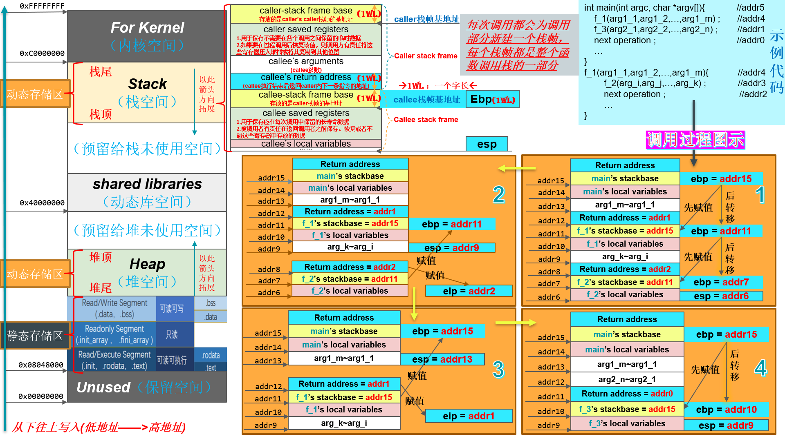

# pwn笔记

## 函数调用栈的解析

•函数调用栈是指程序运行时内存一段连续的区域

•用来保存函数运行时的状态信息，包括函数参数与局部变量等

•称之为“栈”是因为发生函数调用时，调用函数（caller）的状态被保存在栈内，被调用函数（callee）的状态被压入调用栈的栈顶

•在函数调用结束时，栈顶的函数（callee）状态被弹出，栈顶恢复到调用函数（caller）的状态

•函数调用栈在内存中从高地址向低地址生长，所以栈顶对应的内存地址在压栈时变小，退栈时变大

### 注释：

- **上图中的esp、ebp、eip均为寄存器**，其中：

- esp 用来存储函数调用栈的栈顶地址，在压栈和退栈时发生变化。

- ebp 用来存储当前函数状态的基地址，在函数运行时不变，可以用来索引确定函数参数或局部变量的位置。

- eip 用来存储即将执行的程序指令的地址，cpu 依照 eip 的存储内容读取指令并执行，eip 随之指向相邻的下一条指令，如此反复，程序就得以连续执行指令。

- 关于caller&callee saved registers，参见下面的网址：

  [assembly - What are callee and caller saved registers? - Stack Overflow](https://stackoverflow.com/questions/9268586/what-are-callee-and-caller-saved-registers/60903906#60903906)

  [简单理解函数的调用 - 简书 (jianshu.com)](https://www.jianshu.com/p/239bb6bccd39)

- 由上图可知：被调用函数（callee）的参数，返回地址都是调用该函数的函数（caller）栈帧中的一部分。

- 关于字长，参见下面的网址：

  [在64位计算机中，一个字长所占的字节数为?_百度知道 (baidu.com)](https://zhidao.baidu.com/question/17825781.html)

  [(26条消息) 32位计算机的字长是多少个字节,32位计算机中，一个字长等于多少个字节_已经会飞的兔子的博客-CSDN博客](https://blog.csdn.net/weixin_36427631/article/details/118982914)

  #### 总之就是32位计算机1个字长是4个字节，64位计算机1个字长是8个字节

### 函数调用栈的运行过程：

1. 首先将被调用函数（callee）的参数按照逆序依次压入栈内。如果被调用函数（callee）不需要参数，则没有这一步骤。这些参数仍会保存在调用函数（caller）的函数状态内，之后压入栈内的数据都会作为被调用函数（callee）的函数状态来保存。
2. 然后将调用函数（caller）进行调用之后（被调用函数执行完毕）的下一条指令地址作为返回地址压入栈内。这样调用函数（caller）的 eip（指令）信息得以保存（这个动作并未赋给eip值，只是这个和它相关的信息在栈中得以保存）。
3. 再将当前的ebp 寄存器的值（也就是调用函数的基地址）压入栈内，并将 ebp 寄存器的值更新为当前栈顶的地址。这样调用函数（caller）的 ebp（基地址）信息得以保存。同时，ebp 被更新为被调用函数（callee）的基地址。
4. 再之后是将被调用函数（callee）的局部变量等数据压入栈内。
5. 被调用函数执行完毕后，其局部变量会从栈内直接弹出，栈顶会指向被调用函数（callee）的基地址。
6. 然后将基地址内存储的调用函数（caller）的基地址从栈内弹出，并存到 ebp 寄存器内。这样调用函数（caller）的 ebp（基地址）信息得以恢复。此时栈顶会指向返回地址。
7. 再将返回地址从栈内弹出，并存到 eip 寄存器内。这样调用函数（caller）的 eip（指令）信息得以恢复。
8. 至此调用函数（caller）的函数状态就全部恢复了，之后就是继续执行调用函数的指令了。