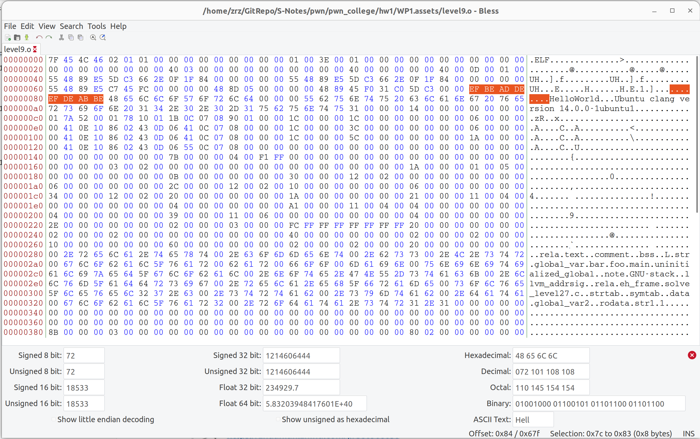
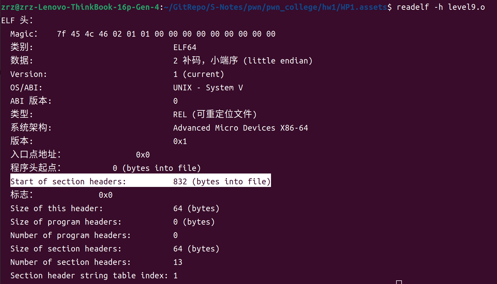
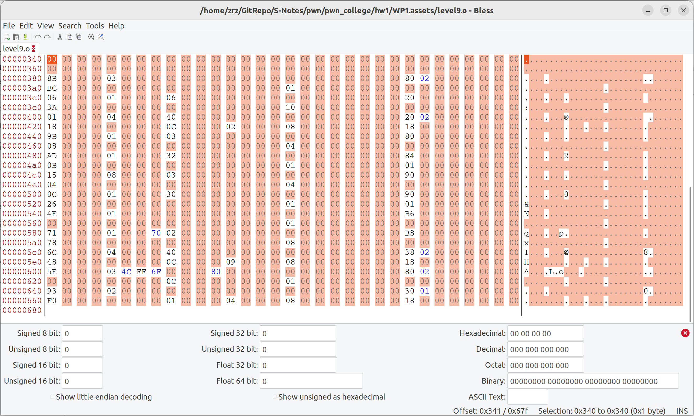
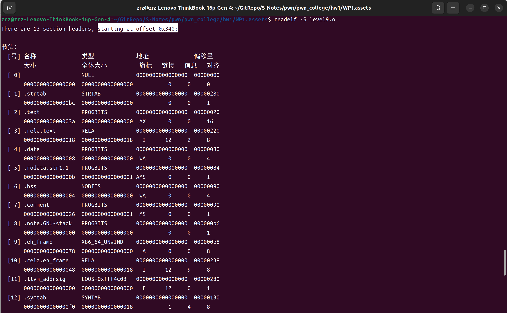

# WP1


## 1.3.1

### cha:

```shell
hacker@assembly~1-3-1:~/hw1$ /challenge/run

Up to now, we have learned how source code is compiled into assembly code. 
The next step is to use an ** assembler ** to convert the assembly code 
into instructions that the machine can "execute". This step is ** assembly **, 
and its output is a ** relocatable object file ** in ELF format. 
Of course, the object file cannot be executed directly. To generate the final 
executable file, we need to use a linker to link the object files together. 
However, the structure and content of object files are not significantly different 
from executable files. The main difference may be that some symbols and 
addresses are not resolved. Therefore, understanding the structure of object files 
is important for comprehending what is Program.

You can get a relocatable object file by using the following command.
1. run `clang-15 -c -o <object_file> <source_code / asm_code>` to generate a 
   relocatable object file from C source code or assembly code.
2. run `llc-15 -march=x86-64 -filetype=obj -o <object_file> <llvm_ir_code>` to 
   generate a relocatable object file from LLVM IR.
3. ... (You can also try other commands to generate object files)

Now we have learned about some of the most important sections in the ELF file format and 
how functions and variables in the source code are mapped to the ELF. However, the compiler 
has even more powerful capabilities. It allows you to place functions or variables into the 
sections you customized.

** Your task **:
1. define 3 functions `foo`, `bar`, `main` in the `.ucastext` section.
2. define a global variable `uninitialized_global` in the `.ucasbss` section.
3. define a global variable `global_var` with value `0xdeadbeef` in the `.ucasdata` section
4. define a global variable `uninitialized_global_2` in the `.bss` section
5. You should submit the `.o` file to finish this challenge.

Hint:
     1. use `objdump -x <ELF_file>` to check the sections of the ELF file.

============================================================
(Hint: You can use tab completion here. )
Please input the path of your submitted file: 
filename> 
```

### solv:

要完成这个挑战，你需要使用 C 语言定义这些函数和变量，并且使用特定的指令将它们放入相应的段。以下是完成这一任务的步骤和代码示例：

1. **编写源代码**：
   - 使用 `__attribute__((section("section_name")))` 指定不同函数和变量应该放在哪个段。
   
   下面是一个 C 语言的示例代码，展示了如何将函数和变量分配到特定的段：

   ```c
   #include <stdint.h>
   
   __attribute__((section(".ucastext"))) void foo() {
       // Function content
   }
   
   __attribute__((section(".ucastext"))) void bar() {
       // Function content
   }
   
   __attribute__((section(".ucastext"))) int main() {
       // Main function content
       return 0;
   }
   
   __attribute__((section(".ucasbss"))) int uninitialized_global;
   
   __attribute__((section(".ucasdata"))) int global_var = 0xdeadbeef;
   
   __attribute__((section(".bss"))) int uninitialized_global_2;
   ```

2. **编译源代码生成目标文件**：
   - 使用 Clang 编译器编译上面的源代码，生成目标文件。假设源代码保存在 `source.c` 文件中，可以使用以下命令：
     ```bash
     clang-15 -c -o target.o source.c
     ```

3. **检查生成的目标文件**：
   - 使用 `objdump -x target.o` 来检查目标文件的段信息，确认 `foo`, `bar`, `main` 函数是否位于 `.ucastext` 段，全局变量是否正确地放置在指定的段中。
   
   - 段信息如下：
   
     ```shell
     1.3/1.3.1/1.o:     file format elf64-x86-64
     1.3/1.3.1/1.o
     architecture: i386:x86-64, flags 0x00000011:
     HAS_RELOC, HAS_SYMS
     start address 0x0000000000000000
     
     Sections:
     Idx Name          Size      VMA               LMA               File off  Algn
       0 .text         00000000  0000000000000000  0000000000000000  00000040  2**2
                       CONTENTS, ALLOC, LOAD, READONLY, CODE
       1 .ucastext     0000002f  0000000000000000  0000000000000000  00000040  2**4
                       CONTENTS, ALLOC, LOAD, READONLY, CODE
       2 .ucasdata     00000004  0000000000000000  0000000000000000  00000070  2**2
                       CONTENTS, ALLOC, LOAD, DATA
       3 .ucasbss      00000004  0000000000000000  0000000000000000  00000074  2**2
                       CONTENTS, ALLOC, LOAD, DATA
       4 .bss          00000004  0000000000000000  0000000000000000  00000078  2**2
                       ALLOC
       5 .comment      0000001d  0000000000000000  0000000000000000  00000078  2**0
                       CONTENTS, READONLY
       6 .note.GNU-stack 00000000  0000000000000000  0000000000000000  00000095  2**0
                       CONTENTS, READONLY
       7 .eh_frame     00000078  0000000000000000  0000000000000000  00000098  2**3
                       CONTENTS, ALLOC, LOAD, RELOC, READONLY, DATA
       8 .llvm_addrsig 00000000  0000000000000000  0000000000000000  00000230  2**0
                       CONTENTS, READONLY, EXCLUDE
     SYMBOL TABLE:
     0000000000000000 l    df *ABS*  0000000000000000 1.c
     0000000000000000 l    d  .ucastext      0000000000000000 .ucastext
     0000000000000000 g     F .ucastext      0000000000000006 foo
     0000000000000010 g     F .ucastext      0000000000000006 bar
     0000000000000020 g     F .ucastext      000000000000000f main
     0000000000000000 g     O .ucasdata      0000000000000004 global_var
     0000000000000000 g     O .ucasbss       0000000000000004 uninitialized_global
     0000000000000000 g     O .bss   0000000000000004 uninitialized_global_2
     
     
     RELOCATION RECORDS FOR [.eh_frame]:
     OFFSET           TYPE              VALUE 
     0000000000000020 R_X86_64_PC32     .ucastext
     0000000000000040 R_X86_64_PC32     .ucastext+0x0000000000000010
     0000000000000060 R_X86_64_PC32     .ucastext+0x0000000000000020
     ```
   
   解决！


## 1.3.2

### cha:

~~~shell
hacker@assembly~1-3-2:~/hw1$ /challenge/run

After finishing the previous challenges, I believe that you have gained a 
general understanding of the outline of an ELF object file. Now let's take 
a look at the overall structure of an ELF object file. We have omitted 
some tedious details of the ELF and extracted the most important structures, 
as shown below:
    +-----------------------------+
    |  ELF Header                 |
    +-----------------------------+
    |                             |
    |  .text                      |
    |                             |
    +-----------------------------+
    |  .data                      | 
    |  .rodata                    |
    +-----------------------------+
    |  .bss                       |
    +-----------------------------+
    |  ...                        |
    |  ...                        |
    |  other sections             |
    +-----------------------------+
    |                             |
    |  section header table       |
    |                             |
    +-----------------------------+
At the very beginning of the ELF (Executable and Linkable Format) file is 
**ELF Header**, which contains metadata describing the entire ELF file, 
including the ELF file version, target machine type, program entry address, etc. 
By parsing the ELF header, we can understand the structure of the entire ELF file.
Another important structure related to ELF is the **Section Header Table**, which 
contains information about all sections in the ELF file, such as the name of section, 
the size of section, the read/write/execute permission of section, etc.

Time to explore the ELF Header. The ELF Header structure is defined in `/usr/include/elf.h`.
Due to the ELF file has both 32-bit and 64-bit versions, the structure of the ELF Header 
has also been defined in two versions, which are `Elf32_Ehdr` and `Elf64_Ehdr`. `Elf64_Ehdr`
has the same structure as `Elf32_Ehdr`, but the size of some fields is different. We use 
`Elf64_Ehdr` as an example to introduce the structure of the ELF Header:
```
typedef struct
{
    unsigned char e_ident[EI_NIDENT];     /* Magic number and other info */
    Elf64_Half    e_type;                 /* Object file type */
    Elf64_Half    e_machine;              /* Architecture */
    Elf64_Word    e_version;              /* Object file version */
    Elf64_Addr    e_entry;                /* Entry point virtual address */
    Elf64_Off     e_phoff;                /* Program header table file offset */
    Elf64_Off     e_shoff;                /* Section header table file offset */
    Elf64_Word    e_flags;                /* Processor-specific flags */
    Elf64_Half    e_ehsize;               /* ELF header size in bytes */
    Elf64_Half    e_phentsize;            /* Program header table entry size */
    Elf64_Half    e_phnum;                /* Program header table entry count */
    Elf64_Half    e_shentsize;            /* Section header table entry size */
    Elf64_Half    e_shnum;                /* Section header table entry count */
    Elf64_Half    e_shstrndx;             /* Section header string table index */
} Elf64_Ehdr;                      
```
We recommend you to explore the structure of the ELF Header by yourself. You can use
`readelf -h <ELF_file>` to check the ELF Header of relocatable object files, and then 
compare the output with the structure of the ELF Header.

In this challenge, you will know what the `e_ident` and `e_type` fields are used for.

** Your task **:
1. I accidentally patched a few bytes in the ELF Header of given object file, and now 
   my tools can't recognize it. Can you help me fix it? I remember I only changed 3 bytes. 
   Please Fix the `level8.o` we provided, make it pass the check.
2. You should submit the `.o` file to finish this challenge.

Hint:
     1. use `readelf -h <ELF_file>` to check the ELF Header of the ELF file.
     2. You can use some hex editor tools to patch bytes in the ELF Header.

============================================================
(Hint: You can use tab completion here. )
Please input the path of your submitted file: 
filename> 
~~~

#### 文件在这里：[level8.o](./WP1.assets/level8.o)

### solv:

> ##### 参考：https://zhuanlan.zhihu.com/p/380908650
>
> 先将.o文件扔到`bless`里看一看，内容如下：
>
> ```.o
> 7F 46 4C 46 01 01 01 00 00 00 00 00 00 00 00 00 02 00 3E 00 01 00 00 00 00 00 00 00 00 00 00 00 00 00 00 00 00 00 00 00 40 03 00 00 00 00 00 00 00 00 00 00 40 00 00 00 00 00 40 00 0D 00 01 00 55 48 89 E5 5D C3 66 2E 0F 1F 84 00 00 00 00 00 55 48 89 E5 5D C3 66 2E 0F 1F 84 00 00 00 00 00 55 48 89 E5 C7 45 FC 00 00 00 00 48 8D 05 00 00 00 00 48 89 45 F0 31 C0 5D C3 00 00 EF BE AD DE EF DE AB BE 48 65 6C 6C 6F 57 6F 72 6C 64 00 00 00 55 62 75 6E 74 75 20 63 6C 61 6E 67 20 76 65 72 73 69 6F 6E 20 31 34 2E 30 2E 30 2D 31 75 62 75 6E 74 75 31 00 00 00 14 00 00 00 00 00 00 00 01 7A 52 00 01 78 10 01 1B 0C 07 08 90 01 00 00 1C 00 00 00 1C 00 00 00 00 00 00 00 06 00 00 00 00 41 0E 10 86 02 43 0D 06 41 0C 07 08 00 00 00 1C 00 00 00 3C 00 00 00 00 00 00 00 06 00 00 00 00 41 0E 10 86 02 43 0D 06 41 0C 07 08 00 00 00 1C 00 00 00 5C 00 00 00 00 00 00 00 1A 00 00 00 00 41 0E 10 86 02 43 0D 06 55 0C 07 08 00 00 00 00 00 00 00 00 00 00 00 00 00 00 00 00 00 00 00 00 00 00 00 00 00 00 00 7B 00 00 00 04 00 F1 FF 00 00 00 00 00 00 00 00 00 00 00 00 00 00 00 00 00 00 00 00 03 00 02 00 00 00 00 00 00 00 00 00 00 00 00 00 00 00 00 00 1A 00 00 00 01 00 05 00 00 00 00 00 00 00 00 00 0B 00 00 00 00 00 00 00 30 00 00 00 12 00 02 00 00 00 00 00 00 00 00 00 06 00 00 00 00 00 00 00 2C 00 00 00 12 00 02 00 10 00 00 00 00 00 00 00 06 00 00 00 00 00 00 00 34 00 00 00 12 00 02 00 20 00 00 00 00 00 00 00 1A 00 00 00 00 00 00 00 21 00 00 00 11 00 04 00 00 00 00 00 00 00 00 00 04 00 00 00 00 00 00 00 A1 00 00 00 11 00 04 00 04 00 00 00 00 00 00 00 04 00 00 00 00 00 00 00 39 00 00 00 11 00 06 00 00 00 00 00 00 00 00 00 04 00 00 00 00 00 00 00 2E 00 00 00 00 00 00 00 02 00 00 00 03 00 00 00 FC FF FF FF FF FF FF FF 20 00 00 00 00 00 00 00 02 00 00 00 02 00 00 00 00 00 00 00 00 00 00 00 40 00 00 00 00 00 00 00 02 00 00 00 02 00 00 00 10 00 00 00 00 00 00 00 60 00 00 00 00 00 00 00 02 00 00 00 02 00 00 00 20 00 00 00 00 00 00 00 00 2E 72 65 6C 61 2E 74 65 78 74 00 2E 63 6F 6D 6D 65 6E 74 00 2E 62 73 73 00 2E 4C 2E 73 74 72 00 67 6C 6F 62 61 6C 5F 76 61 72 00 62 61 72 00 66 6F 6F 00 6D 61 69 6E 00 75 6E 69 6E 69 74 69 61 6C 69 7A 65 64 5F 67 6C 6F 62 61 6C 00 2E 6E 6F 74 65 2E 47 4E 55 2D 73 74 61 63 6B 00 2E 6C 6C 76 6D 5F 61 64 64 72 73 69 67 00 2E 72 65 6C 61 2E 65 68 5F 66 72 61 6D 65 00 73 6F 6C 76 65 5F 6C 65 76 65 6C 32 37 2E 63 00 2E 73 74 72 74 61 62 00 2E 73 79 6D 74 61 62 00 2E 64 61 74 61 00 67 6C 6F 62 61 6C 5F 76 61 72 32 00 2E 72 6F 64 61 74 61 2E 73 74 72 31 2E 31 00 00 00 00 00 00 00 00 00 00 00 00 00 00 00 00 00 00 00 00 00 00 00 00 00 00 00 00 00 00 00 00 00 00 00 00 00 00 00 00 00 00 00 00 00 00 00 00 00 00 00 00 00 00 00 00 00 00 00 00 00 00 00 00 00 00 00 00 00 8B 00 00 00 03 00 00 00 00 00 00 00 00 00 00 00 00 00 00 00 00 00 00 00 80 02 00 00 00 00 00 00 BC 00 00 00 00 00 00 00 00 00 00 00 00 00 00 00 01 00 00 00 00 00 00 00 00 00 00 00 00 00 00 00 06 00 00 00 01 00 00 00 06 00 00 00 00 00 00 00 00 00 00 00 00 00 00 00 40 00 00 00 00 00 00 00 3A 00 00 00 00 00 00 00 00 00 00 00 00 00 00 00 10 00 00 00 00 00 00 00 00 00 00 00 00 00 00 00 01 00 00 00 04 00 00 00 40 00 00 00 00 00 00 00 00 00 00 00 00 00 00 00 20 02 00 00 00 00 00 00 18 00 00 00 00 00 00 00 0C 00 00 00 02 00 00 00 08 00 00 00 00 00 00 00 18 00 00 00 00 00 00 00 9B 00 00 00 01 00 00 00 03 00 00 00 00 00 00 00 00 00 00 00 00 00 00 00 7C 00 00 00 00 00 00 00 08 00 00 00 00 00 00 00 00 00 00 00 00 00 00 00 04 00 00 00 00 00 00 00 00 00 00 00 00 00 00 00 AD 00 00 00 01 00 00 00 32 00 00 00 00 00 00 00 00 00 00 00 00 00 00 00 84 00 00 00 00 00 00 00 0B 00 00 00 00 00 00 00 00 00 00 00 00 00 00 00 01 00 00 00 00 00 00 00 01 00 00 00 00 00 00 00 15 00 00 00 08 00 00 00 03 00 00 00 00 00 00 00 00 00 00 00 00 00 00 00 90 00 00 00 00 00 00 00 04 00 00 00 00 00 00 00 00 00 00 00 00 00 00 00 04 00 00 00 00 00 00 00 00 00 00 00 00 00 00 00 0C 00 00 00 01 00 00 00 30 00 00 00 00 00 00 00 00 00 00 00 00 00 00 00 90 00 00 00 00 00 00 00 26 00 00 00 00 00 00 00 00 00 00 00 00 00 00 00 01 00 00 00 00 00 00 00 01 00 00 00 00 00 00 00 4E 00 00 00 01 00 00 00 00 00 00 00 00 00 00 00 00 00 00 00 00 00 00 00 B6 00 00 00 00 00 00 00 00 00 00 00 00 00 00 00 00 00 00 00 00 00 00 00 01 00 00 00 00 00 00 00 00 00 00 00 00 00 00 00 71 00 00 00 01 00 00 70 02 00 00 00 00 00 00 00 00 00 00 00 00 00 00 00 B8 00 00 00 00 00 00 00 78 00 00 00 00 00 00 00 00 00 00 00 00 00 00 00 08 00 00 00 00 00 00 00 00 00 00 00 00 00 00 00 6C 00 00 00 04 00 00 00 40 00 00 00 00 00 00 00 00 00 00 00 00 00 00 00 38 02 00 00 00 00 00 00 48 00 00 00 00 00 00 00 0C 00 00 00 09 00 00 00 08 00 00 00 00 00 00 00 18 00 00 00 00 00 00 00 5E 00 00 00 03 4C FF 6F 00 00 00 80 00 00 00 00 00 00 00 00 00 00 00 00 80 02 00 00 00 00 00 00 00 00 00 00 00 00 00 00 0C 00 00 00 00 00 00 00 01 00 00 00 00 00 00 00 00 00 00 00 00 00 00 00 93 00 00 00 02 00 00 00 00 00 00 00 00 00 00 00 00 00 00 00 00 00 00 00 30 01 00 00 00 00 00 00 F0 00 00 00 00 00 00 00 01 00 00 00 04 00 00 00 08 00 00 00 00 00 00 00 18 00 00 00 00 00 00 00
> ```
>
> #### ELF 文件的文件头（ELF Header）
>
> ELF 文件头位于目标文件最开始的位置，含有整个文件的一些基本信息。文件头中含有整个文件的结构信息，包括一些控制单元的大小。
>
> 可以使用下面的数据结构来描述 ELF 文件的文件头。
>
> 注：
>
> 下面给出的源码片段截取自`elf.h`，因为例子中生成的是 64 位的 ELF 文件，故在此只给出 64 位 ELF 的文件头的数据结构，这部分与 32 位 ELF 文件的文件头的结构一样，数据结构中成员的字节长度并不一定相同。（2）下方代码中`//`符号后是我注释的具体对应的字节数目。（3）这里的数据结构非常简单，但初学理解容易混乱，文件头是由一个`Elf64_Ehdr`的数据结构组成的，而其中的成员`e_ident`是由16个1字节数据成员组成的数组，为了理解的连贯性，我在介绍`e_ident`之后，直接介绍`e_ident`组成成员。换言之，`e_ident`是`Elf64_Ehdr`的[子项](https://zhida.zhihu.com/search?q=子项&zhida_source=entity&is_preview=1)，而`EI_ABIVERSION`又是`e_ident`子项。
>
> ```c
> #define EI_NIDENT (16)
> 
> typedef struct
> {
>   unsigned char	e_ident[EI_NIDENT]; /* Magic number and other info */       // 1 byte * 16
>   Elf64_Half	e_type;		    /* Object file type */                  // 2 bytes
>   Elf64_Half	e_machine;	    /* Architecture */
>   Elf64_Word	e_version;	    /* Object file version */               // 4 bytes
>   Elf64_Addr	e_entry;	    /* Entry point virtual address */       // 8 bytes
>   Elf64_Off	e_phoff;	    /* Program header table file offset */  // 8 bytes
>   Elf64_Off	e_shoff;	    /* Section header table file offset */      
>   Elf64_Word	e_flags;	    /* Processor-specific flags */             
>   Elf64_Half	e_ehsize;	    /* ELF header size in bytes */
>   Elf64_Half	e_phentsize;	    /* Program header table entry size */
>   Elf64_Half	e_phnum;	    /* Program header table entry count */
>   Elf64_Half	e_shentsize;	    /* Section header table entry size */
>   Elf64_Half	e_shnum;	    /* Section header table entry count */
>   Elf64_Half	e_shstrndx;	    /* Section header string table index */
> } Elf64_Ehdr;
> ```
>
> 各成员按照数据结构中定义的先后顺序，依次介绍意义。
>
> - `e_ident`（**E**LF Header-**Ident**ification）：
>
>    最开始处的这 16 个字节含有 ELF 文件的识别标志，作为一个数组，它的各个索引位置的字节数据有固定的含义，提供一些用于[解码](https://zhida.zhihu.com/search?q=解码&zhida_source=entity&is_preview=1)和解析文件内容的数据，是不依赖于具体操作系统的。
>
>    ELF 格式提供的目标文件框架可以支持多种处理器，以及多种[编码方式](https://zhida.zhihu.com/search?q=编码方式&zhida_source=entity&is_preview=1)。针对不同的[体系结构](https://zhida.zhihu.com/search?q=体系结构&zhida_source=entity&is_preview=1)和编码格式，ELF 文件的内容是会截然不同的。如果不知道编码格式，系统将无法知道怎么去读取目标文件；如果[系统结构](https://zhida.zhihu.com/search?q=系统结构&zhida_source=entity&is_preview=1)与本机不同，也将无法解析和运行。这些信息需要以独立的格式存放在一个默认的地方，所有系统都约定好从文件的同一个地方来读取这些信息，这就是 ELF 标识的作用。
>
>    ELF 文件最开始的这一部分的格式是固定并通用的，在所有平台上都一样。所有处理器都可能用固定的格式去读取这一部分的内容，从而获知这个 ELF 文件中接下来的内容应该如何读取和解析。
>
>    下表介绍`e_ident`数组的结构。其中每个成员均占用 1 字节空间。
>
>    | 数据成员名称  | 数组下标的索引 | 意义                                                         |
>    | ------------- | -------------- | ------------------------------------------------------------ |
>    | EI_MAG0       | 0              | 文件标识                                                     |
>    | EI_MAG1       | 1              | 文件标识                                                     |
>    | EI_MAG2       | 2              | 文件标识                                                     |
>    | EI_MAG3       | 3              | 文件标识                                                     |
>    | EI_CLASS      | 4              | 文件类别                                                     |
>    | EI_DATA       | 5              | 编码格式                                                     |
>    | EI_VERSION    | 6              | [文件版本](https://zhida.zhihu.com/search?q=文件版本&zhida_source=entity&is_preview=1) |
>    | EI_OSABI      | 7              | OS ABI 识别标志                                              |
>    | EI_ABIVERSION | 8              | ABI 版本                                                     |
>    | EI_PAD        | 9              | 补充字节开始的地址                                           |
>
>    **EI_MAG0** ~ **EI_MAG3**（**E**LF **I**dentification-**Mag**ic Number）：文件的最前面 4 字节 e_ident[EI_MAG0] ~ e_ident[EI_MAG3] 的内容被称为“魔数”，用于标识这是一个 ELF 文件。这 4 个字节存放的 16 进制数值是固定的，依次为`0x7f`，`0x45`，`0x4c`和`0x46`，后三个数值对应的 ASCII码 为 “E”，“L” 和 “F”。
>
>    **EI_CLASS**（**E**LF **I**dentification-**Class**）：e_ident[EI_CLASS] 指明文件位数的标志，根据当前字节位置上的数值说明该文件是 32 位的还是 64 位的 ELF 文件。下面为可能的几个取值及其对应的含义。值为 1：32 位目标文件；值为 2：64 位目标文件。下方为源码中的定义、[可取值](https://zhida.zhihu.com/search?q=可取值&zhida_source=entity&is_preview=1)及其对应的含义。
>
>    ```c
>    #define EI_CLASS	4		/* File class byte index */
>    #define ELFCLASSNONE	0		/* Invalid class */
>    #define ELFCLASS32	1		/* 32-bit objects */
>    #define ELFCLASS64	2		/* 64-bit objects */
>    #define ELFCLASSNUM	3
>    ```
>
>    **EI_DATA**（**E**LF **I**dentification-**Data**）：e_ident[EI_DATA] 指明了目标文件中的数据编码格式，指明是[小端编码](https://zhida.zhihu.com/search?q=小端编码&zhida_source=entity&is_preview=1)还是大端编码。值为 1：[补码编码](https://zhida.zhihu.com/search?q=补码编码&zhida_source=entity&is_preview=1)（2's complement）且为小端编码（little endian）；值为 2：补码编码且为大端编码（big endian）。下方为源码中的定义、可取值及其对应的含义。
>
>    注：低位数据存放在高位地址为大端编码，低位数据存放在低位地址为小端编码。
>
>    ```c
>    #define EI_DATA		5		/* Data encoding byte index */
>    #define ELFDATANONE	0		/* Invalid data encoding */
>    #define ELFDATA2LSB	1		/* 2's complement, little endian */
>    #define ELFDATA2MSB	2		/* 2's complement, big endian */
>    #define ELFDATANUM	3
>    ```
>
>    **EI_VERSION**（**E**LF **I**dentification-**Version**）：e_ident[EI_VERSION] 指明 ELF 文件头的版本，目前这个版本号是 EV_CURRENT，即“1”。一般情况下，该位置对应的数值是 1。下方为源码中的定义、可取值及其对应的含义。
>
>    ```c
>    #define EI_ABIVERSION	8	         /* ABI version */
>    ```
>
>    **EI_OSABI**（**E**LF **I**dentification-**O**perating **S**ystem **A**pplication **B**inary **I**nterface Identification）：e_ident[EI_OSABI] 指明 ELF 文件操作系统的二进制接口的[版本标识符](https://zhida.zhihu.com/search?q=版本标识符&zhida_source=entity&is_preview=1)。值为 0：指明 UNIX System V ABI。下方为源码中成员的定义及其中值为 0 代表的含义。
>
>    ```c
>    #define EI_OSABI	7	         /* OS ABI identification */
>    #define ELFOSABI_NONE	0	         /* UNIX System V ABI */
>    ... ...
>    ```
>
>    **EI_ABIVERSION**（**E**LF-**I**dentification）：e_ident[EI_ABIVERSION] 指明 ELF 文件的 ABI 版本。该位置一般值为零。下方为源码中的定义。
>
>    ```c
>    #define EI_ABIVERSION	8	         /* ABI version */
>    ```
>
>    **EI_PAD**（**E**LF **I**dentification-**Pad**ding）：e_ident[EI_PAD] 标记`e_ident`中未使用字节的开始。这些字节被保留并设置为零；读取对象文件的程序应该忽略它们。如果当前未使用的字节被赋予意义，EI_PAD 的值将在将来发生变化。下方为源码中的定义。
>
>    ```c
>    #define EI_PAD	        9	         /* Byte index of padding bytes */
>    ```
>
>    在官方文档中，`e_ident`部分还提到一个成员 EI_NIDENT，位于下表索引 15 的位置（最后一个字节），表示的是`e_ident`数组的大小。我之所以并没有将该成员放入上方进行介绍，我认为这一成员应该是已经被抛弃并不使用了。原因如下：首先在源码（`elf.h`）中，我并没有发现该成员的宏定义；其次，如果按照该成员的定义，该字段出的值应该为 0x10（10 进制为 16），但是实际的值为 0，与定义本身存在矛盾；再者，如果成员 EI_PAD 被定义为未使用字节的开始，按照逻辑来说后方就不再会出现有意义的信息，否则成员 EI_PAD 的定义也存在问题。
>
> - `e_type`（**E**LF Header-**Type**）：该字段（共 2 字节）表明本目标文件属于哪种类型，是 可重定位文件 还是 可执行文件 亦或是 动态链接库文件。值为 1：重定位文件；值为 2：可执行文件；值为 3：[动态链接库文件](https://zhida.zhihu.com/search?q=动态链接库文件&zhida_source=entity&is_preview=1)；值范围在：0xff00 ~ 0xffff 的文件类型是为特定处理器而保留的，如果需要为某种处理器专门设定文件格式，可以从这一范围内选取一个做为标识。在以上已定义范围外的文件类型均为[保留类型](https://zhida.zhihu.com/search?q=保留类型&zhida_source=entity&is_preview=1)，留做以后可能的扩展。下方为源码中的定义、可取值及其对应的含义。
>
>    ```c
>    /* Legal values for e_type (object file type).  */
>    
>    #define ET_NONE		0		/* No file type */
>    #define ET_REL		1		/* Relocatable file */
>    #define ET_EXEC		2		/* Executable file */
>    #define ET_DYN		3		/* Shared object file */
>    #define ET_CORE		4		/* Core file */
>    #define	ET_NUM		5		/* Number of defined types */
>    #define ET_LOOS		0xfe00		/* OS-specific range start */
>    #define ET_HIOS		0xfeff		/* OS-specific range end */
>    #define ET_LOPROC	0xff00		/* Processor-specific range start */
>    #define ET_HIPROC	0xffff		/* Processor-specific range end */
>    ```
>
> - `e_machine`（**E**LF Header-**M**achine）：此字段（2 字节）用于指定该文件适用的[处理器体系结构](https://zhida.zhihu.com/search?q=处理器体系结构&zhida_source=entity&is_preview=1)。在以上已定义范围外的处理器类型均为保留的，在需要的时候将分配给新出现的处理器使用。特别地，该字段对应的 16 进制数为 0x3e（对应 10 进制数为 62），代表的是 AMD x86-64 架构。下方为源码中的部分可取值及其对应的含义。
>
>    ```c
>    /* Legal values for e_machine (architecture).  */
>    ...
>    #define EM_X86_64	62	         /* AMD x86-64 architecture */
>    ...
>    ```
>
> - `e_version`（**E**LF Header-**Version**）：此字段（4 字节）指明目标文件的版本。EV_CURRENT 是一个动态的数字，表示最新的版本。尽管当前最新的版本号就是“1”，但如果以后有更新的版本的话，EV_CURRENT 将被更新为更大的数字，而目前的“1”将成为历史版本。下方为源码中的可取值及其对应的含义。
>
>    ```c
>    /* Legal values for e_version (version).  */
>    
>    #define EV_NONE		0		 /* Invalid ELF version */
>    #define EV_CURRENT	1		 /* Current version */
>    #define EV_NUM		2
>    ```
>
> - `e_entry`（**E**LF Header-**Entry** Address）：此字段（64 位 ELF 文件是 8 字节）指明程序入口的[虚拟地址](https://zhida.zhihu.com/search?q=虚拟地址&zhida_source=entity&is_preview=1)。即当文件被加载到进程空间里后，入口程序在进程地址空间里的地址。对于[可执行程序文件](https://zhida.zhihu.com/search?q=可执行程序文件&zhida_source=entity&is_preview=1)来说，当 ELF 文件完成加载之后，程序将从这里开始运行；而对于其它文件来说，这个值应该是 0。但凡是[地址信息](https://zhida.zhihu.com/search?q=地址信息&zhida_source=entity&is_preview=1)，在分析时，务必注意文件的编码方式，后面内容涉及到不再赘述。
>
> - `e_phoff`（**E**LF Header-**P**rogram **H**eader Table **Off**set）：此字段（8 字节）指明程序头表（program header table）开始处在文件中的偏移量，相对于 ELF 文件初始位置的偏移量。[程序头表](https://zhida.zhihu.com/search?q=程序头表&zhida_source=entity&is_preview=1)又称为段头表，上面介绍过 ELF 的执行试图中涉及到若干的段，而程序头表包含这些段的一个总览的信息。如果没有程序头表，该值应设为 0。`e_phoff`与之后要介绍的`e_phentsize`和`e_phnum`这三个成员描述了 ELF 文件中关于程序头表部分的信息，`e_phoff`：起始地址偏移，程序头表开始的位置；`e_phentsize`：程序头表中每个表项的大小；`e_phnum`：表项的数量。
>
> - `e_shoff`（**E**LF Header-**S**ection **H**eader Table **Off**set）：此字段（8 字节）指明节头表（section header table）开始处在文件中的偏移量。如果没有节头表，该值应设为 0。`e_shoff`与之后要介绍的`e_shentsize`和`e_shnum`这三个成员描述了 ELF 文件中关于[节头表](https://zhida.zhihu.com/search?q=节头表&zhida_source=entity&is_preview=1)部分的信息，`e_shoff`：起始地址偏移，节头表开始的位置；`e_shentsize`：节头表中每个表项的大小；`e_shnum`：表项的数量。
>
> - `e_flags`（**E**LF Header-**Flags**）：此字段（4 字节）含有处理器特定的标志位。对于 Intel 架构的处理器来说，它没有定义任何标志位，所以 e_flags 应该值为 0。
>
> - `e_ehsize`（**E**LF Header-**E**LF **H**eader **Size**）：此字段（2 字节）表明 ELF 文件头的大小，以字节为单位。分析文件时注意[进制转换](https://zhida.zhihu.com/search?q=进制转换&zhida_source=entity&is_preview=1)，后面内容涉及到不再赘述。
>
> - `e_phentsize`（**E**LF Header-**P**rogram **H**eader Table **Ent**ry **Size**）：此字段（2 字节）表明在程序头表中每一个表项的大小，以字节为单位。在 ELF 文件的其他数据结构中也有相同的定义方式，如果一个结构由若干相同的[子结构](https://zhida.zhihu.com/search?q=子结构&zhida_source=entity&is_preview=1)组成，则这些子结构就称为入口。
>
> - `e_phnum`（**E**LF Header-**P**rogram **H**eader Table **Num**ber）：此字段（2 字节）表明程序头表中总共有多少个表项。如果一个目标文件中没有程序头表，该值应设为 0。
>
> - `e_shentsize`（**E**LF Header-**S**ection **H**eader Table **Ent**ry **Size**）：此字段（2 字节）表明在节头表中每一个[表项](https://zhida.zhihu.com/search?q=表项&zhida_source=entity&is_preview=1)的大小，以字节为单位。
>
> - `e_shnum`（**E**LF Header-**S**ection **H**eader Table **Num**ber）：此字段（2 字节）表明节头表中总共有多少个表项。如果一个目标文件中没有节头表，该值应设为 0。
>
> - `e_shstrndx`（**E**LF Header-**S**ection **H**eader Table **Str**ing I**nd**e**x**）：此字段（2 字节）表明节头表中与节名字表相对应的表项的索引。如果文件没有节名字表，此值应设置为 SHN_UNDEF。
>
>    **引入该数据成员的原因**：节头表中每个表项的大小是固定的，但它们的名称不可能一样长，如果将节头表的名字分别存入每个节头表中，节头表过短可能发生名字的失真，节头表过长就可能会出现大量地址未被利用，所以需要将每个节头表的名字统一存到一个专门存储节头表名字的一个节中，即为`.shstrtab`节，而`e_shstrndx`就表明了`.shstrtab`节在所有的节中的索引值，也就是`.shstrtab`节在所有的节中的位置。具体的数据关系的分析放在节的介绍的部分文档中。
>
> **通过 ELF 文件头中提供的信息**，**完全可以掌握 ELF 文件各个部分之间的相对位置关系和字节数量大小**，**可构建出一张 ELF 文件的结构图**，**这也正是 ELF 文件头的作用**。
>
> 修改后文件在这里：[level8.o](./WP1.assets/level8_fix.o)
>

## 1.3.3

### cha:

~~~shell
hacker@assembly~1-3-3:~/hw1$ /challenge/run

After finishing the previous challenges, I believe that you have gained a 
general understanding of the outline of an ELF object file. Now let's take 
a look at the overall structure of an ELF object file. We have omitted 
some tedious details of the ELF and extracted the most important structures, 
as shown below:
    +-----------------------------+
    |  ELF Header                 |
    +-----------------------------+
    |                             |
    |  .text                      |
    |                             |
    +-----------------------------+
    |  .data                      | 
    |  .rodata                    |
    +-----------------------------+
    |  .bss                       |
    +-----------------------------+
    |  ...                        |
    |  ...                        |
    |  other sections             |
    +-----------------------------+
    |                             |
    |  section header table       |
    |                             |
    +-----------------------------+
At the very beginning of the ELF (Executable and Linkable Format) file is 
**ELF Header**, which contains metadata describing the entire ELF file, 
including the ELF file version, target machine type, program entry address, etc. 
By parsing the ELF header, we can understand the structure of the entire ELF file.
Another important structure related to ELF is the **Section Header Table**, which 
contains information about all sections in the ELF file, such as the name of section, 
the size of section, the read/write/execute permission of section, etc.

In this challenge, we will continue to explore other details in the ** Section Header Table **.
```
typedef struct
{
    Elf64_Word    sh_name;                /* Section name (string tbl index) */
    Elf64_Word    sh_type;                /* Section type */
    Elf64_Xword   sh_flags;               /* Section flags */
    Elf64_Addr    sh_addr;                /* Section virtual addr at execution */
    Elf64_Off     sh_offset;              /* Section file offset */
    Elf64_Xword   sh_size;                /* Section size in bytes */
    Elf64_Word    sh_link;                /* Link to another section */
    Elf64_Word    sh_info;                /* Additional section information */
    Elf64_Xword   sh_addralign;           /* Section alignment */
    Elf64_Xword   sh_entsize;             /* Entry size if section holds table */
} Elf64_Shdr;
```
Here we introduce some other key fields in the `Elf64_Shdr` structure.
- `sh_offset`: The section's offset in the ELF file.
- `sh_size`: The section's size.
- `sh_link`, `sh_info`: If the section is related to linking, `sh_link` and `sh_info` have 
                        special meanings, which will be talked about later.
- `sh_addralign`: The section's alignment in the process's virtual address space.
- `sh_entsize`: If the section holds a table, like symbol table, relocation table, 
                `sh_entsize` is the size of each entry in the table.

In this challenge, you will try to recover the correct offset of `.text` section and `.data` section.

** Your task **:
1. I found function and data in the given object file seems weired, can you help me recover them?
2. I remember the correct value of `global_var` is 0xdeadbeef.
3. You just need to patch 2 bytes in Section Header Tables to pass the check.
4. You should submit the `.o` file to finish this challenge.

Hint:
     1. use `readelf -h <ELF_file>` to check the ELF Header of the ELF file.
     2. use `readelf -S <ELF_file>` to check the Section Header Table of the ELF file.
     3. You can use some hex editor tools to patch bytes in the ELF Header.

============================================================
(Hint: You can use tab completion here. )
Please input the path of your submitted file: 
filename> 
~~~

#### 文件在这里：[level9.o](./WP1.assets/level9.o)

### solv:

> ##### 参考：https://zhuanlan.zhihu.com/p/380908650
>
> 本题主要探讨ELF文件中的`Section Header Table`部分，这部分位于整个文件的最后。

直接提交原本的文件，提示如下问题：

```shell
filename> /challenge/level9.o
============================================================
`global_var` should hold 0xdeadbeef, not 0xbeabdeef!
Function `bar`'s prologue should be `b'UH\x89\xe5'`! Not `b'\x00\x00\x00\x00'`!
```

下面解决这些问题：

- 拿到elf文件后先扔到`bless`里查看其字节内容：

  可以看到这里的`DEADBEEF`以及`BEABDEEF`，那我就把`BEABDEEF`改成`DEADBEEF`就行咯

- 说到Function `bar`'s prologue should be `b'UH\x89\xe5'`! Not `b'\x00\x00\x00\x00'`!

  那就找到该位置作修改即可


#### 思路：

- 首先使用`readelf -h`命令查看该文件的`elf`头，以此获得各表项(包括节头表`Section Header Table`)在整个文件中的偏移情况：

  可以看到该elf是**小端序存放数据**，且节头表在整个文件的字节偏移为832，即：`0x340`位置

- 在`bless`中查看其位置：

- 使用`readelf -S`命令查看各个节的基本信息：

  **该命令读取的就是elf文件中的节头表中的内容**，这里也说明了节头表的起始位置为偏移`0x340`

  可以看到各节的详细信息如偏移量、大小以及旗标信息。

- 

