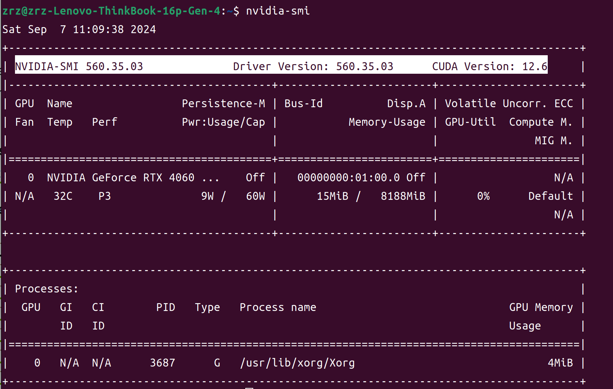
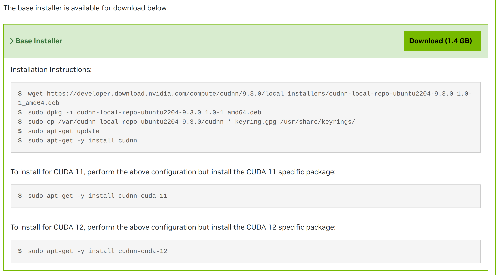

# 环境安装教程

## 本机配置：

> - 显卡：Nvidia-4060
> - 驱动：560.35.03
> - CUDA：12.6.0
> - CUDNN：8.9.7
>
> 

### 安装CUDA：

参考：https://blog.csdn.net/weixin_37926734/article/details/123033286

> 解决Ubuntu20.04无法选择英伟达驱动：
> 参考：https://blog.csdn.net/weixin_42142736/article/details/138294366

### 安装CUDNN：

- 按照官网给出的教程执行：

  > 参考：https://developer.nvidia.com/cudnn-downloads?target_os=Linux&target_arch=x86_64&Distribution=Ubuntu&target_version=22.04&target_type=deb_local

  

- 从输出来看，`cuDNN` 已经安装在你的系统中，且版本为 9.3.0，针对 CUDA 12.6。但是文件仍然没有显示在 `/usr/local/cuda/lib64`，这意味着库文件可能没有正确放置在 CUDA 的默认路径中。

  #### 解决方案：

  1. **查找 libcudnn 的实际位置**

     `dpkg` 显示 cuDNN 已经安装，因此库文件应该存在于系统的某个位置。可以使用以下命令查找 `libcudnn` 库文件：

     ```bash
     sudo find / -name 'libcudnn*'
     ```

     这个命令会搜索系统中所有与 `libcudnn` 相关的文件。找到文件后，你可以手动复制它们到 `/usr/local/cuda/lib64`。

     如果你已经手动复制了 cuDNN 库文件到 `/usr/local/cuda/lib64/` 和头文件到 `/usr/local/cuda/include/`，而现在希望改为使用符号链接，你可以按照以下步骤操作：

  2. **创建符号链接**

     然后，创建符号链接，将 `/usr/lib/x86_64-linux-gnu/` 下的相关文件链接到 `/usr/local/cuda/lib64/` 和 `/usr/local/cuda/include/` 下：

     ```bash
     # 创建库文件的符号链接
     sudo ln -s /usr/lib/x86_64-linux-gnu/libcudnn* /usr/local/cuda/lib64/
     
     # 创建头文件的符号链接
     sudo ln -s /usr/include/cudnn*.h /usr/local/cuda/include/
     ```

  3. **验证符号链接**

     确认符号链接是否成功创建：

     ```bash
     ls -l /usr/local/cuda/lib64/libcudnn*
     ls -l /usr/local/cuda/include/cudnn*.h
     ```

     符号链接应该指向 `/usr/lib/x86_64-linux-gnu/` 和 `/usr/include/` 中的实际文件。

  4. **更新库缓存**

     运行 `ldconfig` 来更新系统的库缓存，以确保新创建的符号链接被识别：

     ```bash
     sudo ldconfig
     ```

  5. **验证 CUDA 和 cuDNN**

     最后，重新验证 CUDA 和 cuDNN 是否可以正常工作，如前面所述的验证步骤。

     通过这种方式，你可以确保系统使用的是安装在标准位置的 cuDNN 文件，同时避免了手动复制可能带来的维护问题。

- 下载之后发现测试cuDNN时无法正常工作。。。

  发现是**cuDNN**的版本和**CUDA**不匹配

  1. 删除之前安装的9.3.0的库：

     要删除通过 `dpkg` 和 `apt-get` 安装的 CUDA 和 cuDNN 库，你可以按照以下步骤操作：

     - **删除 cuDNN 软件包**：
       使用 `apt-get` 卸载安装的 cuDNN 包。首先，找出已安装的 cuDNN 相关包的名称：

       ```bash
       dpkg -l | grep cudnn
       ```

       然后，使用 `apt-get remove` 命令删除这些包。例如：

       ```bash
       sudo apt-get remove --purge cudnn-cuda-12
       ```

     - **删除 cuDNN 存储库和密钥**：

       - 删除 cuDNN 本地存储库：

         ```bash
         sudo rm /etc/apt/sources.list.d/cudnn-local-repo.list
         ```

       - 删除密钥环文件：

         ```bash
         sudo rm /usr/share/keyrings/cudnn-*-keyring.gpg
         ```

     - **清除缓存**：
       使用以下命令更新包列表并清理缓存：

       ```bash
       sudo apt-get update
       sudo apt-get autoremove
       ```

     这些步骤将帮助你完全卸载通过 `dpkg` 和 `apt-get` 安装的 cuDNN 相关库。如果你还安装了其他版本的 CUDA 或 cuDNN 库，你可能需要相应地调整命令中的包名称。

  2. 删除之前的链接

     ```bash
     sudo rm /usr/local/cuda/lib64/libcudnn*
     sudo rm /usr/local/cuda/include/cudnn*.h
     ```

  3. 在[这里](https://developer.nvidia.com/rdp/cudnn-archive)下载合适版本的压缩包文件至：

     `/home/zrz/Projects/Python/CUDA`路径中并解压

  4. 将解压后的文件夹中的：
     库文件链接到 `/usr/local/cuda/lib64/` 、头文件链接到 `/usr/local/cuda/include/`

     ```bash
     # 创建库文件的符号链接
     sudo ln -s /home/zrz/Projects/Python/CUDA/cudnn-linux-x86_64-8.9.7.29_cuda12-archive/lib/libcudnn* /usr/local/cuda/lib64/
     
     # 创建头文件的符号链接
     sudo ln -s /home/zrz/Projects/Python/CUDA/cudnn-linux-x86_64-8.9.7.29_cuda12-archive/include/cudnn*.h /usr/local/cuda/include/
     ```

  5. 验证：

     ```bash
     cat /usr/local/cuda/include/cudnn_version.h | grep CUDNN_MAJOR -A 2
     ```

- 结束！！！
